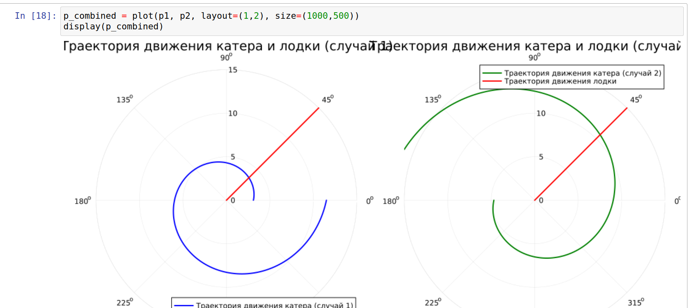
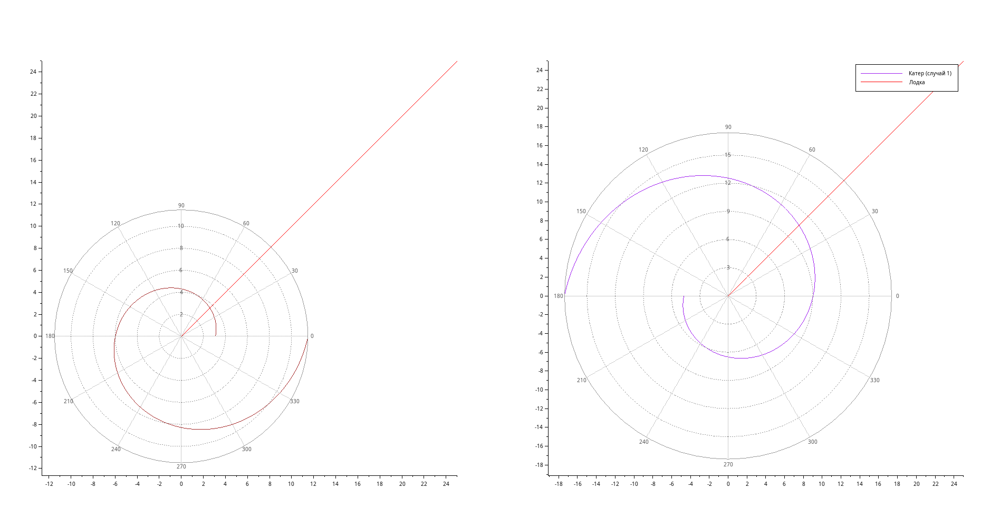
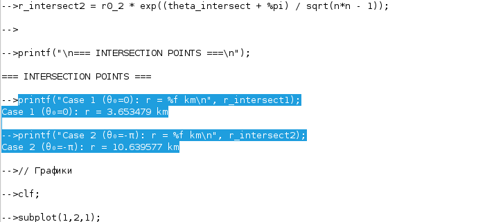

---
author:
  name: Нджову Нелиа
  degrees: DSc
  orcid: 0000-0002-0877-7063
  email: 1032239033@rudn.ru
  affiliation:
    - name: Российский университет дружбы народов
      country: Российская Федерация
      postal-code: 117198
      city: Москва
      address: ул. Миклухо-Маклая, д.15

title: "Презентация по лабораторной работе 2"
subtitle: "Математическое моделирование"
license: "CC BY"
lang: ru

format:
  beamer: 
    pdf-engine: lualatex
    include-in-header: 
      - text: |
          \usepackage{fontspec}
          \setmainfont{DejaVu Serif}
          \setsansfont{DejaVu Sans}
          \setmonofont{DejaVu Sans Mono}
  revealjs: default
---

```{julia}
#| echo: false
#| include: false
using Pkg
Pkg.activate("/home/nelianjovu/work/study/2026-1/2026-1==study--mathmod/2026-1--study--mathmod/labs/lab02/project")
```

## Цель работы

Целью данной лабораторной работы является математическое моделирование задачи преследования браконьерской лодки катером береговой охраны и определение оптимальной траектории движения катера для перехвата цели.

## Задание

1. Провести аналогичные рассуждения и вывод дифференциальных уравнений, если скорость катера больше скорости лодки в n раз (значение n задайте самостоятельно)

2. Построить траекторию движения катера и лодки для двух случаев. (Задайте самостоятельно начальные значения)

3. Определить по графику точку пересечения катера и лодки.

## Выполнение лабораторной работы

*Вариант 64*

На море в тумане катер береговой охраны преследует лодку браконьеров. Через определенный промежуток времени туман рассеивается, и лодка обнаруживается на расстоянии 18,3 км от катера. Затем лодка снова скрывается в тумане и уходит прямолинейно в неизвестном направлении. Известно, что скорость катера в 4,9 раза больше скорости браконьерской лодки.

## Выполнение лабораторной работы

Принимаем за $t_0$ = 0, $x_0 = 0$- место нахождения лодки браконьеров в момент обнаружения, $x_k = k = 18.3$ - место нахождения катера береговой охраны относительно лодки браконьеров в момент обнаружения лодки

Введем полярные координаты. Считаем, что полюс - это точка обнаружения лодки браконьеров $x_0$ ($\theta = x_0 = 0$), а полярная осьr проходит через точку нахождения катера береговой охраны

## Выполнение лабораторной работы

Траектория катера должна быть такой, чтобы и катер, и лодка все время были на одном расстоянии от полюса $\theta$ , только в этом случае траектория катера пересечется с траекторией лодки.

Поэтому для начала катер береговой охраны должен двигаться некоторое
время прямолинейно, пока не окажется на том же расстоянии от полюса, что и лодка браконьеров. После этого катер береговой охраны должен двигаться вокруг полюса удаляясь от него с той же скоростью, что и лодка браконьеров.

## Выполнение лабораторной работы

Чтобы найти расстояниеx (расстояние после которого катер начнет двигаться вокруг полюса), необходимо составить простое уравнение. Пусть через времяt катер и лодка окажутся на одном расстоянииx от полюса. За это время лодка пройдет x, а катер k-x(или k+x, а в зависимости от начального положения катера относительно полюса). Время, за которое они пройдут это расстояние, вычисляется как x/v или k-x/4.9v (во втором случае x+k/4.9v). Так как время одно и то же, то эти величины одинаковы. Тогда неизвестное расстояниеx можно найти из следующего уравнения:

$$
\dfrac{x}{v} = \dfrac{k-x}{5.1v} \text{ -- в первом случае}
$$

$$
\dfrac{x}{v} = \dfrac{k+x}{5.1v} \text{ -- во втором}
$$

## Выполнение лабораторной работы

Отсюда мы найдем два значения $x_1 = \dfrac{18.3}{5.9}$ и $x_2 = \dfrac{18.3}{3.9}$, задачу будем решать для двух случаев.

После того, как катер береговой охраны окажется на одном расстоянии от полюса, что и лодка, он должен сменить прямолинейную траекторию и начать двигаться вокруг полюса удаляясь от него со скоростью лодки $v$. Для этого скорость катера раскладываем на две составляющие: $v_{r}$ - радиальная скорость и  - $v_{\tau}$ тангенциальная скорость. Радиальная скорость - это скорость, с которой катер удаляется от полюса, $v_r = \dfrac{dr}{dt}$. Нам нужно, чтобы эта скорость была равна скорости лодки, поэтому полагаем $\dfrac{dr}{dt} = v$.

## Выполнение лабораторной работы

Тангенциальная скорость – это линейная скорость вращения катера относительно полюса. Она равна произведению угловой скорости $\dfrac{d \theta}{dt}$ на радиус $r$, $r \dfrac{d \theta}{dt}$.

Получаем: 

$$v_{\tau} = \sqrt{4.9^2v^2-v^2} = \sqrt{23.01v^2-v^2} = \sqrt{23.01}v$$

## Выполнение лабораторной работы

Из чего можно вывести:

$$
r\dfrac{d \theta}{dt} = \sqrt{23.01}v
$$

## Выполнение лабораторной работы

Решение исходной задачи сводится к решению системы из двух дифференциальных уравнений:

$$\begin{cases}
&\dfrac{dr}{dt} = v\\
&r\dfrac{d \theta}{dt} = \sqrt{23.01}v
\end{cases}$$

## Выполнение лабораторной работы

С начальными условиями для первого случая:

$$\begin{cases}
&{\theta}_0 = 0\\  \tag{1}
&r_0 = x_1
\end{cases}$$

## Выполнение лабораторной работы

Или для второго:

$$\begin{cases}
&{\theta}_0 = -\pi\\  \tag{2}
&r_0 = x_2
\end{cases}$$

## Выполнение лабораторной работы

Исключая из полученной системы производную по $t$, можно перейти к следующему уравнению:

$$
\dfrac{dr}{d \theta} = \dfrac{r}{\sqrt{23.01}}
$$

## Выполнение лабораторной работы

Начальные условия остаются прежними. Решив это уравнение, мы получим траекторию движения катера в полярных координатах.

Найдем точку пересечения траектории катера и лодки. Для этого найдем аналитическое решение дифференциального уравнения, задающего траекторию движения катера. 

## Выполнение лабораторной работы

Решение Дифференциального уравнения и задачи Коши:

$$
\ln{r}=\frac{\theta}{\sqrt{23.01}} + C
$$

$$
r = Ce^\frac{\theta}{\sqrt{23.01}}
$$

## Выполнение лабораторной работы

$$
r = \frac{18.3}{5.9} e^\frac{\theta}{\sqrt{25.01}} \text{ -- для случая (1)}
$$

$$
r = \frac{18.3}{3.9} e^\frac{\theta+\pi}{\sqrt{25.01}}  \text{ -- для случая (2)}
$$

## Выполнение лабораторной работы

Используя язык программирования Julia, я построил модель для вышеупомянутой системы дифференциальных уравнений. Это дало мне графики, приведенные ниже(рис.1)

{#fig-001 width=70%}

## Выполнение лабораторной работы

Я также визуализировал с помощью scilab, и это дало мне те же графики, что и Джулии(рис.2)

{#fig-002 width=70%}

## Выполнение лабораторной работы

С точки пересечении(рис.3)

{#fig-003 width=70%}

## Выводы

Выполнив эту работу, я создала математическое моделирование задачи преследования браконьерской лодки катером береговой охраны и определение оптимальной траектории движения катера для перехвата цели.
