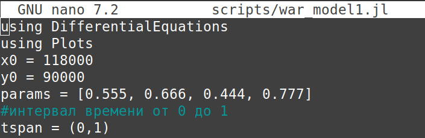
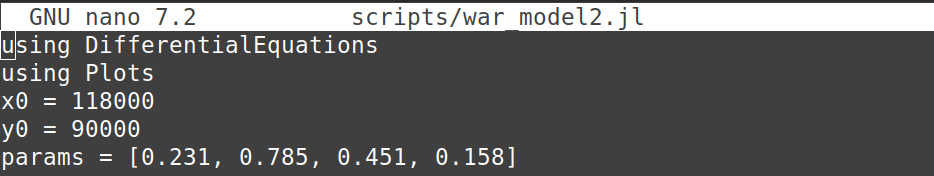
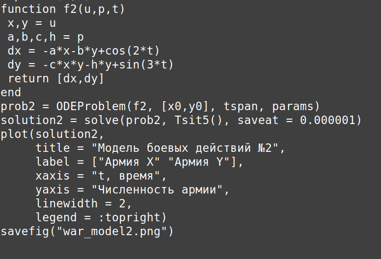
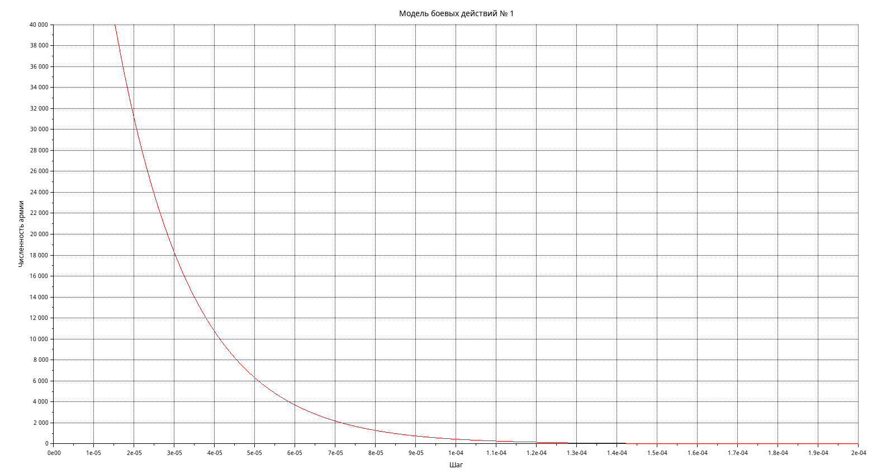

---
## Author
author:
  name: Нджову Нелиа
  degrees: DSc
  orcid: 0000-0002-0877-7063
  email: 1032239033@rudn.ru
  affiliation:
    - name: Российский университет дружбы народов
      country: Российская Федерация
      postal-code: 117198
      city: Москва
      address: ул. Миклухо-Маклая, д. 15

## Title
title: "Отчёта по лабораторной работе 3"
subtitle: "Математическое моделирование"
license: "CC BY"
---

```{julia}
#| echo: false
#| include: false
using Pkg
Pkg.activate("/home/nelianjovu/work/study/2026-1/2026-1==study--mathmod/2026-1--study--mathmod/labs/lab03/project")
```

# Цель работы

Целью данной лабораторной работы является построение математической модели боевых действий

# Задание

**Вариант 64**

Между страной Х и страной У идет война. Численность состава войск исчисляется от начала войны, и являются временными функциями x(t) и y(t).В начальный момент времени страна Х имеет армию численностью 118 000 человек, а в распоряжении страны У армия численностью в 90 000 человек. Для упрощения модели считаем, что коэффициенты a,b,c,h постоянны.Также считаем P(t) и Q(t) непрерывные функции.

Постройте графики изменения численности войск армии Х и армии У для следующих случаев:

1. Модель боевых действий между регулярными войсками
$$
\begin{cases}
\dfrac{dx}{dt} = -0,555x(t)-0,666y(t)+ 2\cos{t}\\
\dfrac{dy}{dt} = -0,444x(t)-0,777y(t)+ 2\sin{t}
\end{cases}
$${#eq:eq:aa}

2. Модель ведение боевых действий с участием регулярных войск и партизанских отрядов

$$
\begin{cases}
\dfrac{dx}{dt} = -0,231x(t)-0,785y(t)+\cos{2t}\\
\dfrac{dy}{dt} = -0,451x(t)y(t)-0,158y(t)+\sin{3t}
\end{cases}
$${#eq:eq:aaa}

# Теоретическое введение

## Модели боевых действий

Модели Ланчестера (уравнения Осипова-Ланчестера) описывают динамику боевых действий между двумя противоборствующими сторонами. Основной характеристикой соперников является численность войск x(t) и y(t). Сторона считается проигравшей, если её численность в какой-то момент времени обращается в ноль (при положительной численности противника).

### 1. Модель боевых действий между регулярными войсками

Численность регулярных войск определяется тремя факторами:
- **Потери, не связанные с боевыми действиями** (болезни, травмы, дезертирство)
- **Потери от боевых действий** противоборствующих сторон
- **Поступление подкрепления** P(t) и Q(t)

Система дифференциальных уравнений:

$$
\begin{cases}
\dfrac{dx}{dt} = -a(t)x(t) - b(t)y(t) + P(t) \\
\dfrac{dy}{dt} = -c(t)x(t) - h(t)y(t) + Q(t)
\end{cases}
$${#eq:eq:a}

где:
- a(t), h(t) — коэффициенты, характеризующие потери, не связанные с боевыми действиями
- b(t), c(t) — эффективность боевых действий сторон (качество стратегии, вооружения, профессионализм)
- P(t), Q(t) — функции подкрепления

### 2. Модель с участием регулярных войск и партизанских отрядов

Партизанские отряды менее уязвимы, так как действуют скрытно. Противник вынужден действовать неизбирательно, по площадям. Темп потерь партизан пропорционален не только численности регулярных войск, но и численности самих партизан.

Система уравнений:

$$
\begin{cases}
\dfrac{dx}{dt} = -a(t)x(t) - b(t)y(t) + P(t) \\
\dfrac{dy}{dt} = -c(t)x(t)y(t) - h(t)y(t) + Q(t)
\end{cases}
$${#eq:eq:a}

### 3. Модель боевых действий между партизанскими отрядами

$$
\begin{cases}
\dfrac{dx}{dt} = -a(t)x(t) - b(t)x(t)y(t) + P(t) \\
\dfrac{dy}{dt} = -c(t)x(t)y(t) - h(t)y(t) + Q(t)
\end{cases}
$${#eq:eq:a}

### 4. Простейшая (жесткая) модель

При упрощении (постоянные коэффициенты, отсутствие небоевых потерь и подкреплений):

$$
\begin{cases}
\dfrac{dx}{dt} = - by\\
\dfrac{dy}{dt} = -cx
\end{cases}
$${#eq:eq:a}

Данная система имеет точное решение:
$$
cx^2 - by^2 = C
$$

Эволюция численностей происходит вдоль гипербол. Если начальная точка лежит выше прямой $cx = by$, выигрывает армия Y; если ниже — выигрывает армия X. На разделяющей прямой война заканчивается истреблением обеих армий за бесконечное время.

*Важный вывод:* для борьбы с вдвое более многочисленным противником требуется в четыре раза более мощное оружие, с втрое более многочисленным — в девять раз и т.д. (квадратичная зависимость).

### 5. Упрощение модели с партизанскими войсками

$$
\begin{cases}
\dfrac{dx}{dt} = - by\\
\dfrac{dy}{dt} = -cxy
\end{cases}
$${#eq:eq:a}

Приводится к уравнению:
$$
\dfrac{d}{dt}\left(\frac{b}{2}x^2(t) - cy(t)\right) = 0
$$

Которое имеет решение:
$$
\dfrac{b}{2}x^2(t) - cy(t) = \frac{b}{2}x^2(0) - cy(0) = C_1
$$

- При $C_1 > 0$ побеждает регулярная армия
- При $C_1 < 0$ побеждают партизаны

*Вывод:* регулярные войска находятся в более выгодном положении, так как для победы им требуется меньший рост начальной численности по сравнению с партизанами (линейный против квадратичного).

# Выполнение лабораторной работы

## Модель боевых действий между регулярными войсками

### Реализация в Julia

Модель боевых действий между регулярными войсками. Я присваиваю значения коэффициенту смертности, который не связан с боевыми операциями, и коэффициентам эффективности первой и второй армий. Значения приведены в задаче.Я использую библиотеки DifferentialEquations для работы с дифференциальными уравнениями и Plots для построения графиков(рис.1).

{#fig-001 width=70%}

Функция, описывающая подход первого подкрепления армии, θ(θ) = 2cos(t), второе подкрепление армии описывается функцией θ(θ) = 2sin(t). Затем получаем систему, описывающую противостояние регулярных войск 𝑋 и 𝑌. Я записываю систему ODE с помощью функции, задаю соответствующую задачу Коши с помощью ODEProblem и решаю ее с помощью solve, затем строю график решения(рис.2)

{#fig-002 width=70%}

В результате мы видим, что при таких параметрах модели армия X побеждает(рис.3)

{#fig-003 width=70%}

### Реализация в scilab

Я создаю ту же модель, используя scilab. Модель определяется следующим образом:

```
x0 = 118000;
y0 = 90000;
t0 = 0;

a = 0.555;
b = 0.666;
c = 0.444;
h = 0.777;

tmax = 1;

dt = 0.01;

t = [t0:dt:tmax];

function p = P(t)
p = 2*cos(t);
endfunction

function q = Q(t)
q = 2*sin(t);
endfunction

function dy = syst(t,y)
dy(1) = -a*y(1)-b*y(2)+P(t);
dy(2) = -c*y(1)-h*y(2)+Q(t);
endfunction

v0 = [x0;y0];

y = ode(v0,t0,t,syst);

scf(0);
plot2d(t,y(1,:),style=2);
xtitle("Модель боевых действий № 1", "Шаг", "Численность армии");
plot2d(t,y(2,:), style=5);
xgrid();

```

Мы видим, что график совпадает с тем, который мы получили с помощью Julia, никакой разницы(рис.4)

{#fig-004 width=70%}

## Модель ведение боевых действий с участием регулярных войск и партизанских отрядов

### Реализация в Julia

Модель боевых действий между регулярными войсками. Я присваиваю значения коэффициенту смертности, который не связан с боевыми операциями, и коэффициентам эффективности первой и второй армий. Значения приведены в задаче(рис.5).

{#fig-005 width=70%}

Функция, описывающая подход первого подкрепления армии, θ(θ) = cos(2t), второе подкрепление армии описывается функцией θ(θ) = sin(3t). Затем получаем систему, описывающую противостояние регулярных войск 𝑋 и 𝑌. Я записываю систему ODE с помощью функции, задаю соответствующую задачу Коши с помощью ODEProblem и решаю ее с помощью solve, затем строю график решения(рис.6)

{#fig-006 width=70%}

В результате мы видим, что при таких параметрах модели армия X побеждает за короткий промежуток времени(рис.7)

{#fig-007 width=70%}

### Реализация в scilab

Я создаю ту же модель, используя scilab. Модель определяется следующим образом:

```
x0 = 118000;
y0 = 90000;
t0 = 0;

a = 0.231;
b = 0.785;
c = 0.451;
h = 0.158;

tmax = 1;

dt = 0.000001;

t = [t0:dt:tmax];

function p = P(t)
p = cos(2*t);
endfunction

function q = Q(t)
q = sin(3*t);
endfunction

function dy = syst(t,y)
dy(1) = -a*y(1)-b*y(2)+P(t);
dy(2) = -c*y(1)*y(2)-h*y(2)+Q(t);
endfunction

v0 = [x0;y0];

y = ode(v0,t0,t,syst);

scf(0);
clf();
plot2d(t, y(1,:), style=2, rect=[0, 0, 0.0002, 40000]);
plot2d(t, y(2,:), style=5, rect=[0, 0, 0.0002, 40000]);
xtitle("Модель боевых действий № 1", "Шаг", "Численность армии");
xgrid();

```

Мы видим, что график совпадает с тем, который мы получили с помощью Julia, никакой разницы(рис.8)

{#fig-008 width=70%}

Чтобы ясно видеть, как уменьшается количество солдат армии Y, я установила пределы x и y от 0,0002 до 40000(рис.9)

{#fig-009 width=70%}

# Выводы

В этой лабораторной работе я построила математическую модель боевых действий.
