---
## Author
author:
  name: Нджову Нелиа
  degrees: DSc
  orcid: 0000-0002-0877-7063
  email: 1032239033@rudn.ru
  affiliation:
    - name: Российский университет дружбы народов
      country: Российская Федерация
      postal-code: 117198
      city: Москва
      address: ул. Миклухо-Маклая, д. 15

## Title
title: "Отчёта по лабораторной работе 4"
subtitle: "Математическое моделирование"
license: "CC BY"
---

```{julia}
#| echo: false
#| include: false
using Pkg
Pkg.activate("/home/nelianjovu/work/study/2026-1/2026-1==study--mathmod/2026-1--study--mathmod/labs/lab04/project")
```

# Цель работы

Целью данной лабораторной работы является построение математической модели гармонических колебаний.

# Задание

## Вариант 64
Постройте фазовый портрет гармонического осциллятора и решение уравнения гармонического осциллятора для следующих случаев

1. Колебания гармонического осциллятора без затуханий и без действий внешней силы $\ddot{x} + 8.8x = 0$

2. Колебания гармонического осциллятора c затуханием и без действий внешней силы $\ddot{x} + 8\dot{x} + 8x = 0$

3. Колебания гармонического осциллятора c затуханием и под действием внешней силы $\ddot{x} + 8\dot{x} + 8x = 0.8\sin(8t)$

На интервале $t \in [0; 88]$ (шаг 0.05) с начальными условиями $x_0 = 1.8,\,y_0 = 0.8$

# Теоретическое введение

## Модель гармонического осциллятора

Гармонические колебания — это колебания, при которых физическая величина изменяется с течением времени по гармоническому (синусоидальному или косинусоидальному) закону. Такие колебания являются частным случаем периодических колебаний и широко встречаются в различных физических системах: движение груза на пружине, математический маятник, колебания заряда в электрическом контуре и другие.

### Уравнение гармонического осциллятора

Линейный гармонический осциллятор описывается дифференциальным уравнением второго порядка:

$$
\ddot{x} + 2\gamma \dot{x} + \omega_0^2 x = 0 \tag{1}
$$

где:
- $x$ — переменная, описывающая состояние системы (смещение грузика, заряд конденсатора и т.д.);
- $\gamma$ — параметр затухания, характеризующий потери энергии (трение в механической системе, сопротивление в электрическом контуре);
- $\omega_0$ — собственная частота колебаний системы;
- $t$ — время;
- $\dot{x} = \frac{dx}{dt}$, $\ddot{x} = \frac{d^2x}{dt^2}$ — первая и вторая производные по времени.

### Консервативный осциллятор (без затухания)

При отсутствии потерь энергии ($\gamma = 0$) уравнение (1) принимает вид уравнения консервативного осциллятора:

$$
\ddot{x} + \omega_0^2 x = 0 \tag{2}
$$

В этом случае энергия колебаний сохраняется во времени, амплитуда колебаний остается постоянной, а движение системы является периодическим.

### Затухающие колебания

При наличии затухания ($\gamma > 0$) амплитуда колебаний постепенно уменьшается. В зависимости от соотношения между $\gamma$ и $\omega_0$ возможны три режима:

- **Слабое затухание** ($\gamma < \omega_0$): система совершает затухающие колебания;
- **Критическое затухание** ($\gamma = \omega_0$): система возвращается в положение равновесия за минимальное время без колебаний;
- **Сильное затухание** ($\gamma > \omega_0$): система апериодически возвращается в положение равновесия.

### Вынужденные колебания

Если на систему действует внешняя периодическая сила, уравнение движения принимает вид:

$$
\ddot{x} + 2\gamma \dot{x} + \omega_0^2 x = F(t) \tag{3}
$$

где $F(t)$ — внешняя сила. В данной лабораторной работе рассматривается гармоническая внешняя сила вида:

$$
F(t) = A \sin(\omega t) \quad \text{или} \quad F(t) = A \cos(\omega t)
$$

При действии внешней силы система совершает вынужденные колебания. После затухания переходного процесса устанавливаются стационарные колебания с частотой внешней силы $\omega$.

### Переход от уравнения второго порядка к системе первого порядка

Для анализа фазового пространства уравнение второго порядка (2) можно преобразовать в систему двух уравнений первого порядка. Введем новую переменную $y = \dot{x}$. Тогда:

$$
\begin{cases}
\dot{x} = y \\
\dot{y} = -\omega_0^2 x
\end{cases} \tag{4}
$$

Начальные условия при этом принимают вид:

$$
\begin{cases}
x(t_0) = x_0 \\
y(t_0) = y_0
\end{cases} \tag{5}
$$

### Фазовое пространство и фазовый портрет

Независимые переменные $x$ и $y$ определяют **фазовое пространство** системы. Поскольку оно двумерно, его называют **фазовой плоскостью**. Значения фазовых координат $x$ и $y$ в любой момент времени полностью определяют состояние системы.

**Фазовая траектория** — это гладкая кривая в фазовой плоскости, которая соответствует решению уравнения движения как функции времени. Каждая точка на фазовой траектории соответствует определенному состоянию системы в заданный момент времени.

**Фазовый портрет** — это совокупность фазовых траекторий, соответствующих различным начальным условиям, изображенных на одной фазовой плоскости. Фазовый портрет позволяет наглядно представить качественное поведение системы.

Для гармонического осциллятора без затухания фазовые траектории представляют собой замкнутые кривые (эллипсы), что указывает на периодический характер колебаний. При наличии затухания фазовые траектории представляют собой спирали, сходящиеся к началу координат (положению равновесия).

# Выполнение лабораторной работы

## Реализация в Julia и Scilab

Я устанавливаю параметры и определяю функцию для решения модели линейного гармонического осциллятора и функцию для случаев однородного уравнения и неоднородного уравнения отдельно в julia(рис.1)

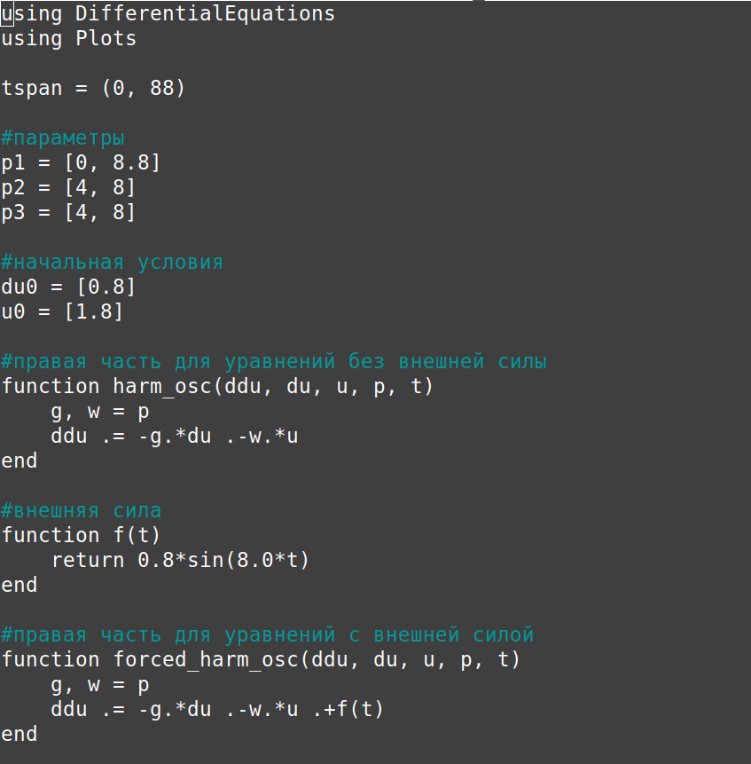{#fig-001 width=70%}

Я использую функцию SecondOrderODEProblem для определения проблемы и численный метод DPKN6() для ее решения(рис.2)

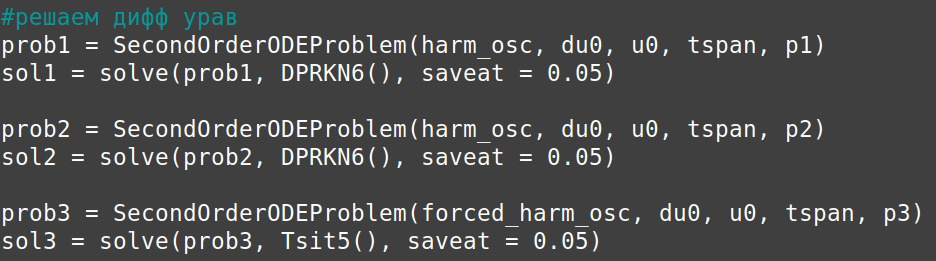{#fig-002 width=70%}

После этого я визуализирую(рис.3)

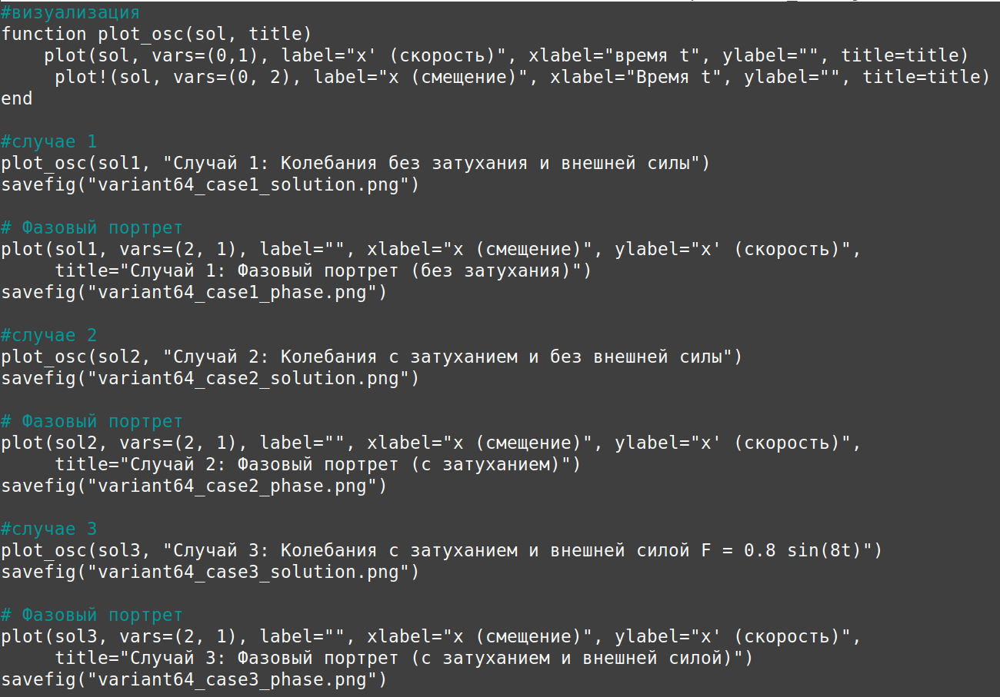{#fig-003 width=70%}

Я создаю такую же модель с помощью scilab

```
// Параметры
w1 = 8.8;
g1 = 0;

w2 = 8.0;
g2 = 8.0;

// Начальные условия
x0 = [1.8; 0.8];

// Время: t ∈ [0; 88] с шагом 0.05
t0 = 0;
t = [0:0.05:88];

// Внешняя сила
function f = force(t)
    f = 0.8 * sin(8.0 * t);
endfunction

// Функция для уравнений без внешней силы
function dx = harm_osc(t, x)
    dx(1) = x(2);
    dx(2) = -w * x(1) - g * x(2);
endfunction

// Функция для уравнений с внешней силой
function dx = forced_harm_osc(t, x)
    dx(1) = x(2);
    dx(2) = -w * x(1) - g * x(2) + force(t);
endfunction

// Случай 1: без затухания и без внешней силы
w = w1;
g = g1;

x = ode(x0, t0, t, harm_osc);

n = size(x, "c");
for i = 1:n
    x1_case1(i) = x(1, i);
    x2_case1(i) = x(2, i);
end

// График колебаний
scf(0);
clf();
plot(t, x1_case1, 'b-', 'LineWidth', 1.5);
plot(t, x2_case1, 'r-', 'LineWidth', 1.5);
xlabel('Время t');
ylabel('');
title('Случай 1: Колебания без затухания и внешней силы');
legend('x (смещение)', 'x'' (скорость)');
xgrid();
savefig('variant64_case1_solution.png');

// Фазовый портрет
scf(1);
clf();
plot(x1_case1, x2_case1, 'g-', 'LineWidth', 1.5);
xlabel('x (смещение)');
ylabel('x'' (скорость)');
title('Случай 1: Фазовый портрет (без затухания)');
xgrid();
savefig('variant64_case1_phase.png');

// Случай 2: с затуханием и без внешней силы
w = w2;
g = g2;

x = ode(x0, t0, t, harm_osc);

n = size(x, "c");
for i = 1:n
    x1_case2(i) = x(1, i);
    x2_case2(i) = x(2, i);
end

// График колебаний
scf(2);
clf();
plot(t, x1_case2, 'b-', 'LineWidth', 1.5);
plot(t, x2_case2, 'r-', 'LineWidth', 1.5);
xlabel('Время t');
ylabel('');
title('Случай 2: Колебания с затуханием и без внешней силы');
legend('x (смещение)', 'x'' (скорость)');
xgrid();
savefig('variant64_case2_solution.png');

// Фазовый портрет
scf(3);
clf();
plot(x1_case2, x2_case2, 'm-', 'LineWidth', 1.5);
xlabel('x (смещение)');
ylabel('x'' (скорость)');
title('Случай 2: Фазовый портрет (с затуханием)');
xgrid();
savefig('variant64_case2_phase.png');

// Случай 3: с затуханием и под действием внешней силы
w = w3;
g = g3;

x = ode(x0, t0, t, forced_harm_osc);

n = size(x, "c");
for i = 1:n
    x1_case3(i) = x(1, i);
    x2_case3(i) = x(2, i);
end

// График колебаний
scf(4);
clf();
plot(t, x1_case3, 'b-', 'LineWidth', 1.5);
plot(t, x2_case3, 'r-', 'LineWidth', 1.5);
xlabel('Время t');
ylabel('');
title('Случай 3: Колебания с затуханием и внешней силой F = 0.8 sin(8t)');
legend('x (смещение)', 'x'' (скорость)');
xgrid();
savefig('variant64_case3_solution.png');

// Фазовый портрет
scf(5);
clf();
plot(x1_case3, x2_case3, 'c-', 'LineWidth', 1.5);
xlabel('x (смещение)');
ylabel('x'' (скорость)');
title('Случай 3: Фазовый портрет (с затуханием и внешней силой)');
xgrid();
savefig('variant64_case3_phase.png');

```

## Колебания гармонического осциллятора без затуханий и без действий внешней силы

Графики, которые я получил от julia и scilab, совпадают(рис 4 и 5)

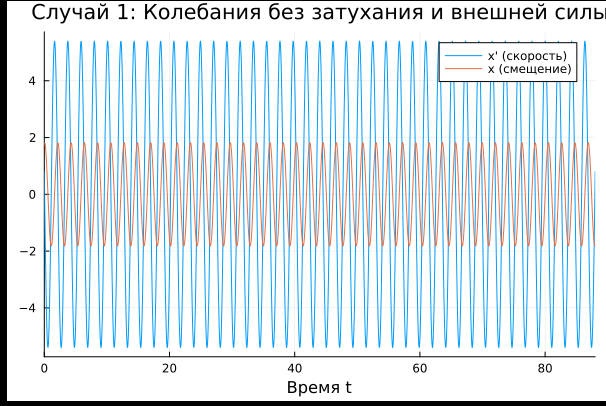{#fig-004 width=70%}

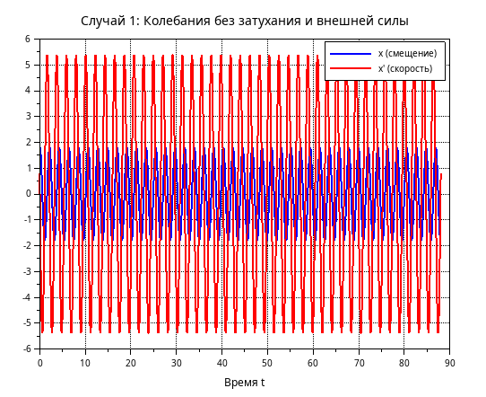{#fig-005 width=70%}

Фазовые портреты также одинаковы(рис 6 и 7)

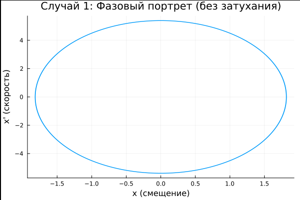{#fig-006 width=70%}

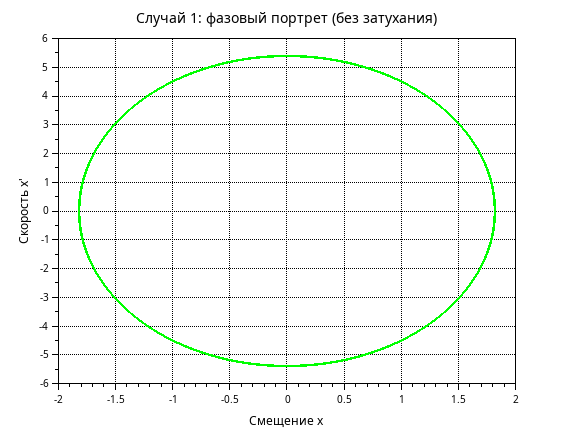{#fig-007 width=70%}

*Мы видим, что генератор периодически совершает колебания, график не исчезает, а решение системы дифференциальных уравнений всегда движется по одной и той же траектории.*
 
## Колебания гармонического осциллятора с затуханий и без действий внешней силы

Графики, которые я получил от julia и scilab, совпадают(рис 8 и 9)

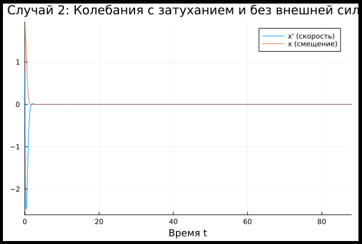{#fig-008 width=70%}

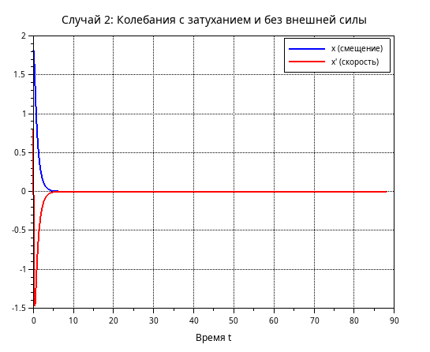{#fig-009 width=70%}

Фазовые портреты также одинаковы(рис 10 и 11)

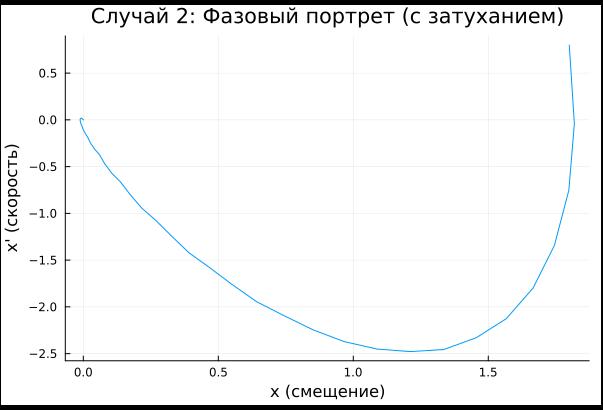{#fig-010 width=70%}

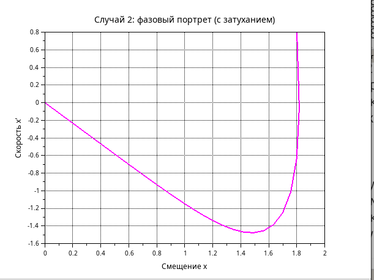{#fig-011 width=70%}

*Мы видим, что сначала осциллятор совершает колебания, а затем график исчезает.*

## Колебания гармонического осциллятора с затуханий и внешней силы $F(t) = 0.8\sin{(8t)}$

Графики, которые я получил от julia и scilab, совпадают(рис 12 и 13)

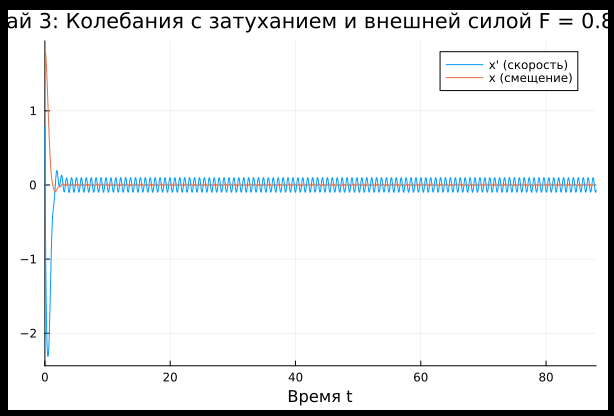{#fig-012 width=70%}

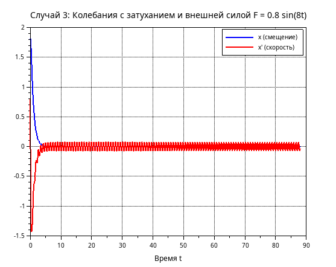{#fig-013 width=70%}

Фазовые портреты также одинаковы(рис 14 и 15)

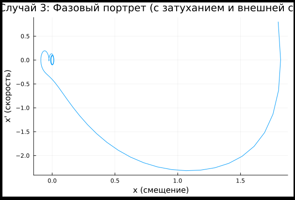{#fig-014 width=70%}

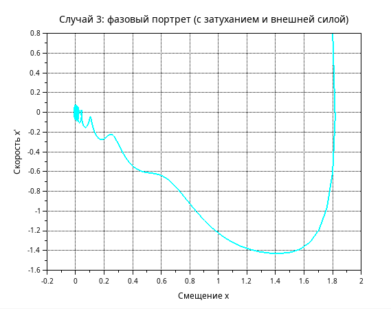{#fig-015 width=70%}

*Мы видим, что система приходит в состояние равновесия, период колебаний больше, чем в первом случае, так как затухание замедляет его, мы также видим, что под воздействием внешней силы колебания продолжаются, но их амплитуда меньше.*

## Ответы на вопросы

### 1. Запишите простейшую модель гармонических колебаний

Простейшая модель гармонических колебаний описывается уравнением консервативного осциллятора:

$$
\ddot{x} + \omega_0^2 x = 0
$$

Где x переменная состояния, $\omega_0$ собственная частота колебаний

### 2. Дайте определение осциллятора

Осциллятор — это система, которая совершает колебания, то есть периодически изменяет свое состояние вблизи положения равновесия. В общем случае поведение осциллятора описывается дифференциальным уравнением второго порядка:

$$
\ddot{x} + 2\gamma \dot{x} + \omega_0^2 x = 0
$$

### 3. Запишите модель математического маятника

Для малых углов отклонения ($\theta \ll 1$) модель математического маятника записывается как:

$$
\ddot{\theta} + \frac{g}{l} \theta = 0
$$

где $\theta$ — угловое отклонение от вертикали, $g$ — ускорение свободного падения, $l$ — длина подвеса. В стандартной форме гармонического осциллятора:

$$
\ddot{\theta} + \omega_0^2 \theta = 0, \quad \omega_0 = \sqrt{\frac{g}{l}}
$$

### 4. Запишите алгоритм перехода от дифференциального уравнения второго порядка к двум дифференциальным уравнениям первого порядка

1. Ввести новую переменную $y = \dot{x}$ (первая производная исходной переменной)
2. Выразить $\dot{y} = \ddot{x}$ из исходного уравнения
3. Записать систему двух уравнений первого порядка:

   $$
   \begin{cases}
   \dot{x} = y \\
   \dot{y} = -\omega_0^2 x - 2\gamma y + F(t)
   \end{cases}
   $$

### 5. Что такое фазовый портрет и фазовая траектория?

**Фазовая траектория** — это кривая в фазовом пространстве (плоскости), описывающая изменение состояния системы во времени. Каждая точка на траектории соответствует определенному состоянию системы.

**Фазовый портрет** — это совокупность фазовых траекторий, соответствующих различным начальным условиям, построенных на одной фазовой плоскости. Фазовый портрет позволяет качественно анализировать поведение системы и определять типы движений.


# Выводы

Выполнив эту лабораторную работу я построила математическую модель гармонического осциллятора и провелила анализ
s
