---
author:
  name: Нджову Нелиа
  degrees: DSc
  orcid: 0000-0002-0877-7063
  email: 1032239033@rudn.ru
  affiliation:
    - name: Российский университет дружбы народов
      country: Российская Федерация
      postal-code: 117198
      city: Москва
      address: ул. Миклухо-Маклая, д.15

title: "Презентация по лабораторной работе 5"
subtitle: "Математическое моделирование"
license: "CC BY"
lang: ru

format:
  beamer: 
    pdf-engine: lualatex
    include-in-header: 
      - text: |
          \usepackage{fontspec}
          \setmainfont{DejaVu Serif}
          \setsansfont{DejaVu Sans}
          \setmonofont{DejaVu Sans Mono}
  revealjs: default
---

```{julia}
#| echo: false
#| include: false
using Pkg
Pkg.activate("/home/nelianjovu/work/study/2026-1/2026-1==study--mathmod/2026-1--study--mathmod/labs/lab04/project")
```

## Цель работы

Целью данной лабораторной работы является построение математической модели хищник-жертва.

## Задание

*Вариант 64*

Для модели «хищник-жертва»:

$$
\begin{cases}
\frac{dx}{dt} = -0.48x(t) + 0.031x(t)y(t)\\
\frac{dy}{dt} = 0.68y(t) - 0.031x(t)y(t)
\end{cases}
$$(2.1)

Постройте график зависимости численности хищников от численности жертв, а также графики изменения численности хищников и численности жертв при следующих начальных условиях: $x_0 = 3$, $y_0 = 18$. Найдите стационарное состояние системы.

## Теоретическое введение

Простейшая модель взаимодействия двух видов типа «хищник — жертва»  модель Лотки-Вольтерры. Данная двувидовая модель основывается на следующих предположениях:

1. Численность популяции жертв x и хищников y зависят только от времени (модель не учитывает пространственное распределение популяции на занимаемой территории)

2. В отсутствии взаимодействия численность видов изменяется по модели Мальтуса, при этом число жертв увеличивается, а число хищников падает

3. Естественная смертность жертвы и естественная рождаемость хищника считаются несущественными

4. Эффект насыщения численности обеих популяций не учитывается

5. Скорость роста численности жертв уменьшается пропорционально численности хищников

## Теоретическое введение

$$
\begin{cases}
\frac{dx}{dt} = ax(t) - bx(t)y(t)\\
\frac{dy}{dt} = -cy(t) + dx(t)y(t)
\end{cases}
$$(3.1)

В этой модели x – число жертв, y - число хищников. Коэффициент a описывает скорость естественного прироста числа жертв в отсутствие хищников, с естественное вымирание хищников, лишенных пищи в виде жертв. Вероятность взаимодействия жертвы и хищника считается пропорциональной как количеству жертв, так и числу самих хищников (xy). Каждый акт взаимодействия уменьшает популяцию жертв, но способствует увеличению популяции хищников (члены -bxy и dxy в правой части уравнения)

## Теоретическое введение

Найдём стационарное состояние системы (3.1). Для этого приравняем её правые части к нулю

$$
\begin{cases}
ax(t)-bx(t)y(t) = 0\\
-cy(t)+dx(t)y(t) = 0
\end{cases}
$$(3.2)

## Теоретическое введение

Из полученной системы (3.2) получаем, что стационарное состояние системы будет в точке $x_0 = c/d$, $y_0 = a/b$. Если начальные значения задать в стационарном состоянии $x(0) = x_0$, $y(0) = y_0$, то в любой момент времени численность популяций изменяться не будет. При малом отклонении от положения равновесия численности как хищника, так и жертвы с течением времени не возвращаются к равновесным значениям, а совершают периодические колебания вокруг стационарной точки.

## Поиск стационарного состояния системы

Найдём стационарное состояние системы (2.1). Для этого приравняем её правые части к нулю

$$
\begin{cases}
  -0.48x(t)+0.031x(t)y(t) = 0\\
  0.68y(t)- 0.031x(t)y(t) = 0
\end{cases}
$$(4.1)

## Поиск стационарного состояния системы

$$
\begin{cases}
  -0.48 + 0.031y(t) = 0\\
  0.68 - 0.031x(t) = 0
\end{cases}
$$(4.2)

Из полученной системы получаем, что стационарное состояние системы будет в точке $x_0 = 0.68/0.031 = 21.9355$, $y_0 = 0.48/0.031 = 15.4839$. Если начальные значения задать в стационарном состоянии $x(0) = x_0$, $y(0) = y_0$, то в любой момент времени численность популяций изменяться не будет. При малом отклонении от положения равновесия численности как хищника, так и жертвы с течением времени не возвращаются к равновесным значениям, а совершают периодические колебания вокруг стационарной точки.

## Реализация в Julia

Зададим начальные значения функций и параметры, а также интервал интегрирования(рис.1)

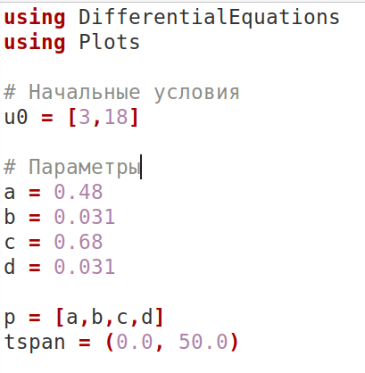{#fig-001 width=70%}

## Реализация в Julia

Зададим функцию для решения модели хищник-жертва. Для задания проблемы используется функция `ODEProblem`, а для решения -- численный метод `Tsit5()`(рис.2)

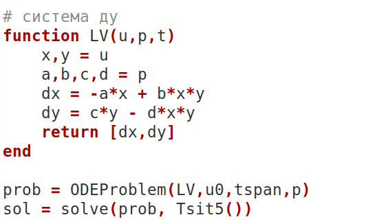{#fig-002 width=70%}

## Реализация в Julia

С помощью `plot` строим графики решения модели, а также фазовый портрет (рис.3, 4 и 5)

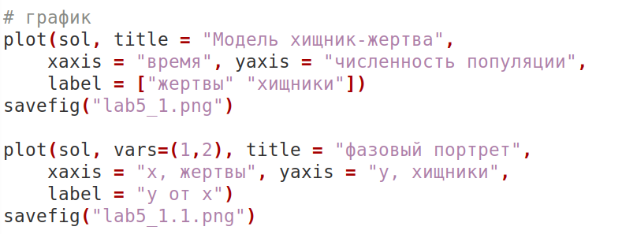{#fig-003 width=70%}

## Реализация в Julia

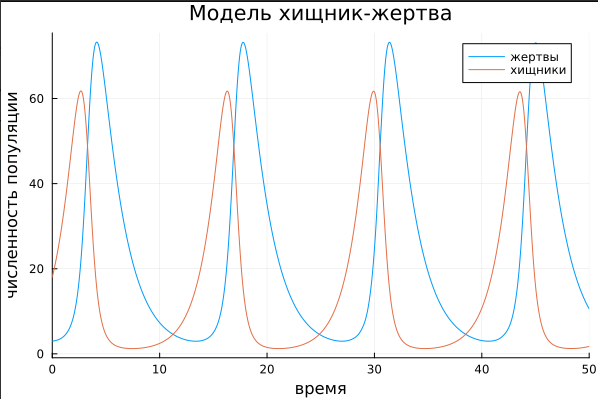{#fig:004 width=70%}

## Реализация в Julia

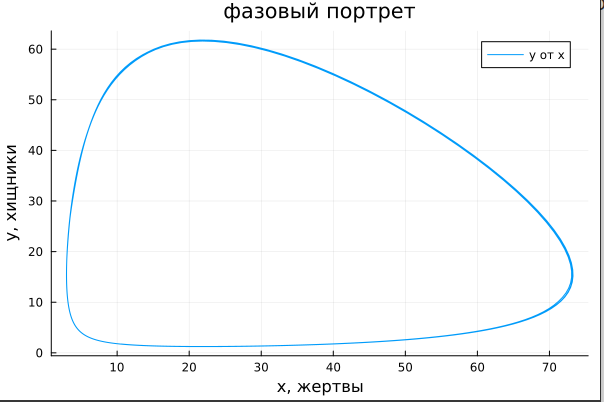{#fig:005width=70%}

## Реализация в Julia

Проверим найденное стационарное состояние с помощью вычислений в программе, для этого используем деление соответствующих параметров и получим `x_c`, `y_c`. Если это стационарное состояние системы,то на графике решения мы не увидим изменения функций, а на фазовом портрете получим одну точку. Поэтому зададим проблему со стационарным состоянием в виде начального условия и решим ее(рис.6 и 7)

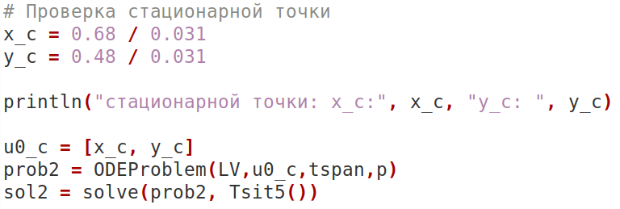{#fig-006 width=70%}

## Реализация в Julia

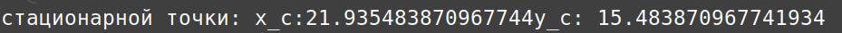{#fig-007 width=70%}

## Реализация в Julia

С помощью `plot` построим графики решения и фазовый портрет (рис.8, 9 и 10)

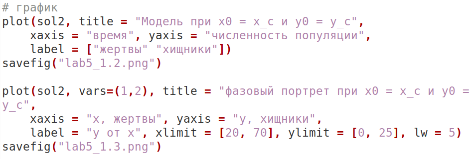{#fig-008 width=70%}

## Реализация в Julia

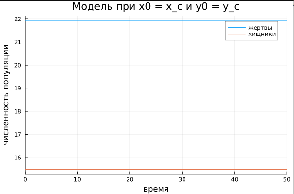{#fig:009 width=70%}

## Реализация в Julia

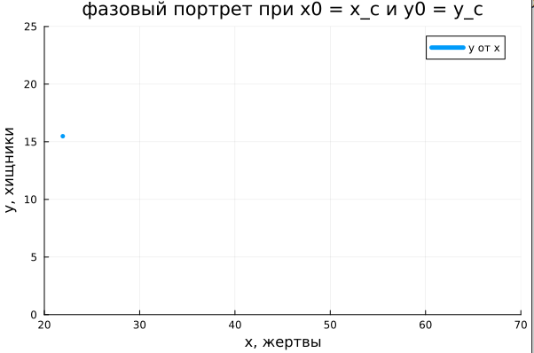{#fig:010 width=70%}

## Реализация в Julia

Видим, что значения решений остаются неизменными, значит, мы верно определили стационарное состояние системы.

## Реализация в OpenModelica

Сначала зададим модель с данными в условиях варианта начальными значениями. После установки симуляции получим следующие графики решения модели и фазового портрета (рис.11 и 12)

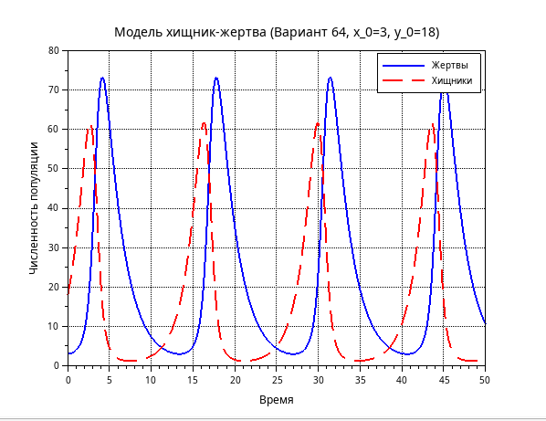{#fig:011 width=70%}

## Реализация в OpenModelica

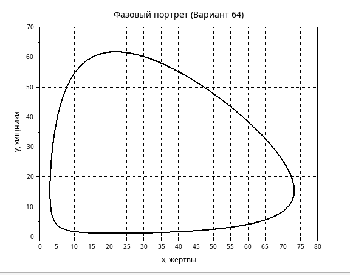{#fig:012 width=70%}

## Реализация в OpenModelica

Далее поменяем начальное значение на стационарное состояние системы. После установки симуляции получим следующие графики решения модели и фазового портрета (рис.13 и 14)

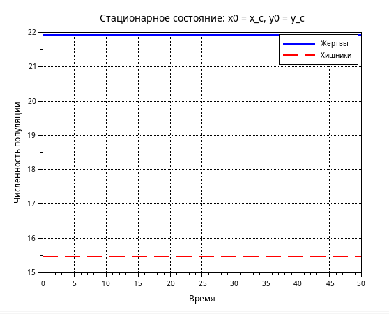{#fig:013 width=70%}

## Реализация в OpenModelica

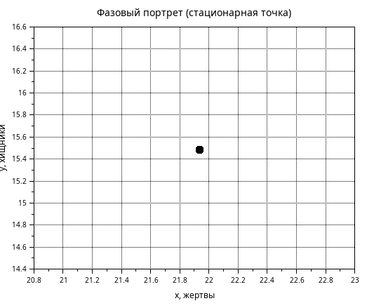{#fig:008 width=70%}

## Реализация в OpenModelica

Графики, полученнные в OpenModelica идентичны графикам в Julia.

## Выводы

Выполнив эту лабораторную работу, я построила математическую модель хищник жертва и провели анализ.
