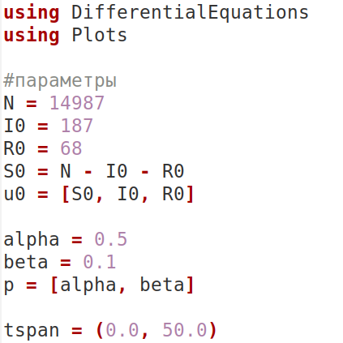
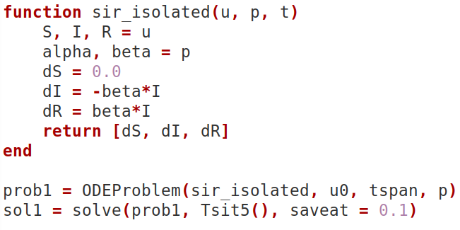
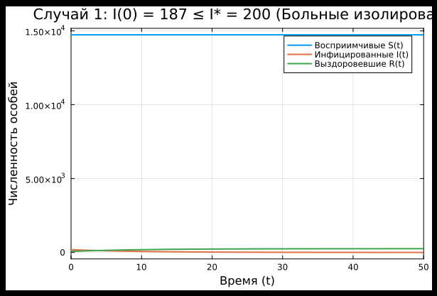
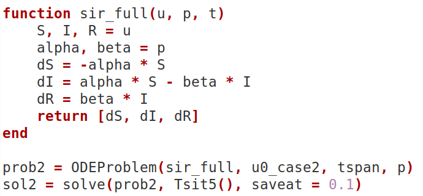
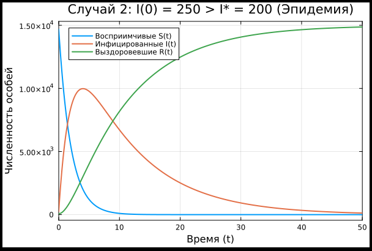
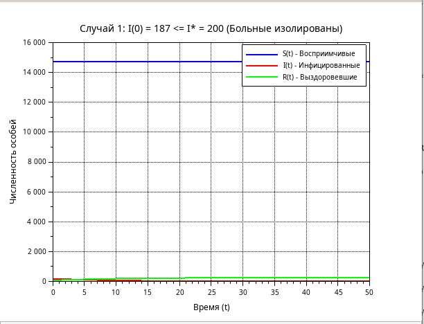
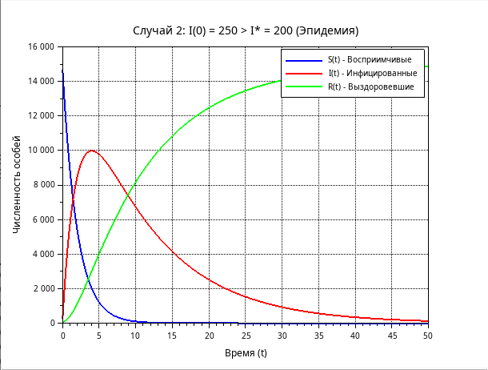

---
## Author
author:
  name: Нджову Нелиа
  degrees: DSc
  orcid: 0000-0002-0877-7063
  email: 1032239033@rudn.ru
  affiliation:
    - name: Российский университет дружбы народов
      country: Российская Федерация
      postal-code: 117198
      city: Москва
      address: ул. Миклухо-Маклая, д. 15

## Title
title: "Отчёта по лабораторной работе 6"
subtitle: "Математическое моделирование"
license: "CC BY"
---

```{julia}
#| echo: false
#| include: false
using Pkg
Pkg.activate("/home/nelianjovu/work/study/2026-1/2026-1==study--mathmod/2026-1--study--mathmod/labs/lab04/project")
```

# Цель работы

Целью данной лабораторной работы является построение математической модели Эпидемии.

# Задание

*Вариант 64*

На одном острове вспыхнула эпидемия. Известно, что из всех проживающих на острове (N=14 987) в момент начала эпидемии (t=0) число заболевших людей (являющихся распространителями инфекции) I(0)=187, А число здоровых людей с иммунитетом к болезни R(0)=68. Таким образом, число людей восприимчивых к болезни, но пока здоровых, в начальный момент времени S(0)=N-I(0)- R(0).

Постройте графики изменения числа особей в каждой из трех групп. Рассмотрите, как будет протекать эпидемия в случае:

1) если $I(0) \leq I^*$

2) если $I(0) > I^*$

# Теоретическое введение

Рассмотрим простейшую модель эпидемии. Предположим, что некая популяция, состоящая из N особей, (считаем, что популяция изолирована) подразделяется на три группы. Первая группа - это восприимчивые к болезни, но пока здоровые особи, обозначим их через S(t). Вторая группа – это число инфицированных особей, которые также при этом являются распространителями инфекции, обозначим их I(t). А третья группа, обозначающаяся через R(t) – это здоровые особи с иммунитетом к болезни.

До того, как число заболевших не превышает критического значения
I*, считаем, что все больные изолированы и не заражают здоровых. Когда* $I(0) > I^*$, тогда инфицирование способны заражать восприимчивых к болезни особей.

Таким образом, скорость изменения числа S(t) меняется по следующему
закону:

$$
\frac{dS}{dt} = 
\begin{cases}
-\alpha S, & \text{если } I(t) > I^* \\
0, & \text{если } I(t) \leq I^*
\end{cases}
$$

Поскольку каждая восприимчивая к болезни особь, которая, в конце концов, заболевает, сама становится инфекционной, то скорость изменения числа инфекционных особей представляет разность за единицу времени между заразившимися и теми, кто уже болеет и лечится, т.е.:

$$
\frac{dI}{dt} = 
\begin{cases}
\alpha S - \beta I, & \text{если } I(t) > I^* \\
-\beta I, & \text{если } I(t) \leq I^*
\end{cases}
$$

А скорость изменения выздоравливающих особей (при этом приобретающие иммунитет к болезни)

$$
\frac{dR}{dt} = \beta I
$$

Постоянные пропорциональности, $\alpha, \beta$ - это коэффициенты заболеваемости и выздоровления соответственно.

Для того, чтобы решения соответствующих уравнений определялось однозначно, необходимо задать начальные условия .Считаем, что на начало эпидемии в момент времени t = 0 нет особей с иммунитетом к болезни R(0)=0, а число инфицированных и восприимчивых к болезни особей I(0) и S(0) соответственно. Для анализа картины протекания эпидемии необходимо рассмотреть два случая: $I(0) \leq I^*$ и $I(0) > I^*$

# Выполнение лабораторной работы

## Реализация в Julia

Зададим начальные значения, время интегрирования и параметры модели(рис.1).

{#fig-001 width=70%}

### 1. если $I(0) \leq I^*$

Рассмотрим случай 1, когда количество заболевших не превышает критического значения I*, то есть мы предполагаем, что все больные изолированы и не заражают здоровых людей. Определим функцию для нашего случая с помощью формул, а также зададим задачу Коши с помощью ODEProblem, решать мы ее будем с помощью solve. Для построения графика используем plot(рис.2)

{#fig-002 width=70%}

Из графика видно, что число уязвимых здоровых людей не увеличивается, потому что все больные изолированы и не могут заразить других. Больные в конечном итоге выздоравливают или умирают, поэтому число инфицированных уменьшается, а число выздоровевших увеличивается(рис.3)

{#fig-003 width=70%}

### 2. если $I(0) > I^*$

Давайте рассмотрим случай 2, когда число случаев превышает критическое значение I*, то есть мы считаем, что инфицированные люди все еще находятся в контакте с восприимчивыми лицами, следовательно, они способны заразить их.  В этом случае мы также зададим задачу Коши, используя ODEProblem, и решим ее с помощью solve. Мы используем plot для построения графика(рис.4)

{#fig-004 width=70%}

На графике мы видим, что число восприимчивых людей уменьшается, пока не достигнет предела, это происходит потому, что заражаются все. Сначала число больных увеличивается, но со временем, когда люди выздоравливают или умирают, оно начинает уменьшаться, что приводит к увеличению числа выздоровевших(рис.5)

{#fig-005 width=70%}

## Реализация в Scilab

Я реализую варианты 1 и 2 с помощью scilab

'''
alpha = 0.5;
beta = 0.1;

N = 14987;
I0_case1 = 187;
R0 = 68;
S0_case1 = N - I0_case1 - R0;

I_star = 200;
t0 = 0;
t = 0:0.1:50;


//I(0) <= I*

function dx = epidemic_isolated(t, x)
    // x(1) = S(t) - восприимчивые к болезни
    // x(2) = I(t) - инфицированные
    // x(3) = R(t) - здоровые с иммунитетом
    dx(1) = 0;
    dx(2) = -beta * x(2);
    dx(3) = beta * x(2);
endfunction

x0_case1 = [S0_case1; I0_case1; R0];

y_case1 = ode(x0_case1, t0, t, epidemic_isolated);

scf(1);
plot(t, y_case1(1,:), 'b-', 'LineWidth', 2);  // S(t) - синий
plot(t, y_case1(2,:), 'r-', 'LineWidth', 2);  // I(t) - красный
plot(t, y_case1(3,:), 'g-', 'LineWidth', 2);  // R(t) - зелёный

xlabel('Время (t)');
ylabel('Численность особей');
title(['Случай 1: I(0) = ' + string(I0_case1) + ' <= I* = ' + string(I_star) + ' (Больные изолированы)']);
legend(['S(t) - Восприимчивые'; 'I(t) - Инфицированные'; 'R(t) - Выздоровевшие'], 'box');
xgrid();

// Сохранение графика
xs2png(0, 'epidemic_case1_scilab.png');

// СЛУЧАЙ 2: I(0) > I*

I0_case2 = 250;  // Это > I_star = 200
S0_case2 = N - I0_case2 - R0;  // = 14987 - 250 - 68 = 14669

function dx = epidemic_full(t, x)
    dx(1) = -alpha * x(1);
    dx(2) = alpha * x(1) - beta * x(2);
    dx(3) = beta * x(2);
endfunction

x0_case2 = [S0_case2; I0_case2; R0];
y_case2 = ode(x0_case2, t0, t, epidemic_full);

// Построение графика
scf(2);
plot(t, y_case2(1,:), 'b-', 'LineWidth', 2);
plot(t, y_case2(2,:), 'r-', 'LineWidth', 2);
plot(t, y_case2(3,:), 'g-', 'LineWidth', 2);
xlabel('Время (t)');
ylabel('Численность особей');
title(['Случай 2: I(0) = ' + string(I0_case2) + ' > I* = ' + string(I_star) + ' (Эпидемия)']);
legend(['S(t) - Восприимчивые'; 'I(t) - Инфицированные'; 'R(t) - Выздоровевшие'], 'box');
xgrid();

// Сохранение графика
xs2png(0, 'epidemic_case2_scilab.png');

'''

Мы видим, что графики, которые мы получаем как в случае 1, так и в случае 2, аналогичны тем, которые мы получили при использовании julia(рис 6 и 7)

{#fig-005 width=70%}

{#fig-005 width=70%}

# Выводы

В этой работе, мы построили математической модели Эпидемии
