---
author:
  name: Нджову Нелиа
  degrees: DSc
  orcid: 0000-0002-0877-7063
  email: 1032239033@rudn.ru
  affiliation:
    - name: Российский университет дружбы народов
      country: Российская Федерация
      postal-code: 117198
      city: Москва
      address: ул. Миклухо-Маклая, д.15

title: "Презентация по лабораторной работе 7"
subtitle: "Математическое моделирование"
license: "CC BY"
lang: ru

format:
  beamer: 
    pdf-engine: lualatex
    include-in-header: 
      - text: |
          \usepackage{fontspec}
          \setmainfont{DejaVu Serif}
          \setsansfont{DejaVu Sans}
          \setmonofont{DejaVu Sans Mono}
  revealjs: default
---

```{julia}
#| echo: false
#| include: false
using Pkg
Pkg.activate("/home/nelianjovu/work/study/2026-1/2026-1==study--mathmod/2026-1--study--mathmod/labs/lab04/project")
```

## Цель работы

Целью данной лабораторной работы является построение математической модели Эффективность рекламы.

## Задание

**Вариант 64**

Постройте график распространения рекламы, математическая модель которой описывается следующим уравнением:

1. $\frac{dn}{dt} = (0.605 + 0.000015n(t))(N - n(t))$

2. $\frac{dn}{dt} = (0.000025 + 0.205n(t))(N - n(t))$

3. $\frac{dn}{dt} = (0.05sin(t) + 0.31cos(t)n(t))(N - n(t))$

При этом объем аудитории N = 1515, в начальный момент о товаре знает 12 человек. Для случая 2 определите в какой момент времени скорость распространения рекламы будет иметь максимальное значение.

## Теоретическое введение

**Эффективность рекламы**

Организуется рекламная кампания нового товара или услуги. Необходимо, чтобы прибыль будущих продаж с избытком покрывала издержки на рекламу. Вначале расходы могут превышать прибыль, поскольку лишь малая часть потенциальных покупателей будет информирована о новинке. Затем, при увеличении числа продаж, возрастает и прибыль, и, наконец, наступит момент, когда рынок насытиться, и рекламировать товар станет бесполезным.

Предположим, что торговыми учреждениями реализуется некоторая продукция, о которой в момент времениt из числа потенциальных покупателей N знает лишьn покупателей. Для ускорения сбыта продукции запускается реклама по радио, телевидению и других средств массовой информации. После запуска рекламной кампании информация о продукции начнет распространяться среди потенциальных покупателей путем общения друг с другом. Таким образом, после запуска рекламных объявлений скорость изменения числа знающих о продукции людей пропорциональна как числу знающих о товаре покупателей, так и числу покупателей о нем не знающих 

## Теоретическое введение

Модель рекламной кампании описывается следующими величинами. Считаем, что dn/dt - скорость изменения со временем числа потребителей, узнавших о товаре и готовых его купить,t - время, прошедшее с начала рекламной кампании,n(t) - число уже информированных клиентов. Эта величина пропорциональна числу покупателей, еще не знающих о нем, это описывается следующим образом: $a_1(t)(N - n(t))$, где N - общее число потенциальных

## Теоретическое введение

платежеспособных покупателей, $a_1(t) > 0$ - характеризует интенсивность рекламной кампании (зависит от затрат на рекламу в данный момент времени). Помимо этого, узнавшие о товаре потребители также распространяют полученную информацию среди потенциальных покупателей, не знающих о нем (в этом случае работает т.н. сарафанное радио). Этот вклад в рекламу описывается величиной $a_2(t)n(t)(N - n(t))$, эта величина увеличивается с увеличением потребителей узнавших о товаре. Математическая модель распространения рекламы описывается уравнением:

$$
\frac{dn}{dt} = (a_1(t) + a_2(t)n(t))(N - n(t))
$$

## Реализация в Julia

Давайте определим функцию для решения модели эффективности рекламы. Для каждого случая мы используем разные интервалы интеграции, а также задаем начальное значение интеграции и параметры модели. Мы зададим начальные условия и функции для трех случаев(рис.1)

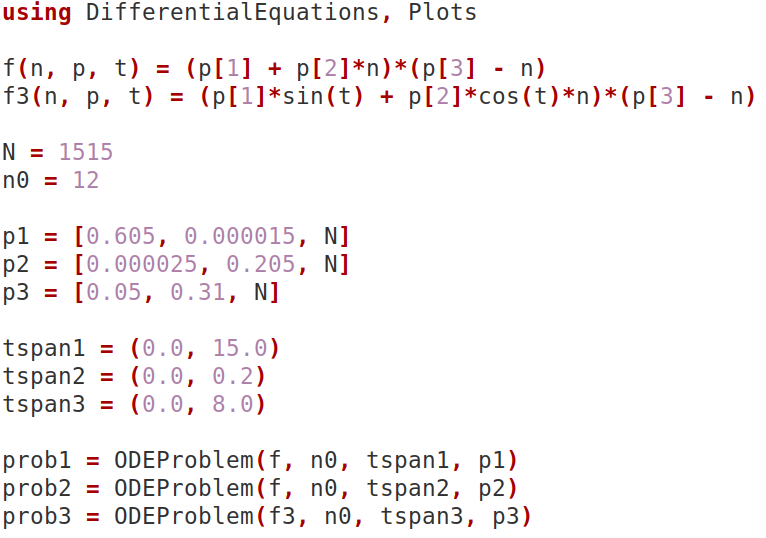{#fig-001 width=70%}

## Реализация в Julia

Найдем решение для первого случая и построим его график(рис.2)

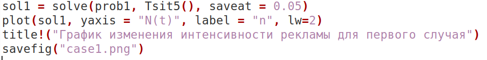{#fig-001 width=70%}

## Реализация в Julia

В первом случае, когда a_1 больше по величине, чем a_2, график движется стабильно, а затем замедляется по мере того, как многие люди узнают о продукте(рис.3)

## Реализация в Julia

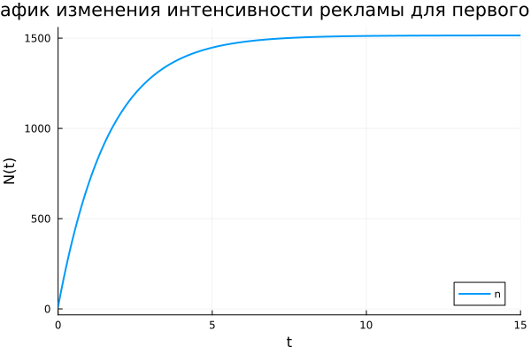{#fig-001 width=70%}

## Реализация в Julia

Найдем решение для второго случая и построим его. Также найдем время, когда производная принимает максимальное значение(рис.4)

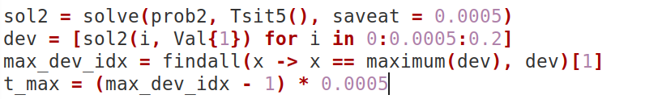{#fig-001 width=70%}

## Реализация в Julia

В случае 2 мы видим, что кривая сначала движется так быстро, что достигает максимума, отмеченного красной точкой, намного быстрее, чем в случае 1(рис.5)

## Реализация в Julia

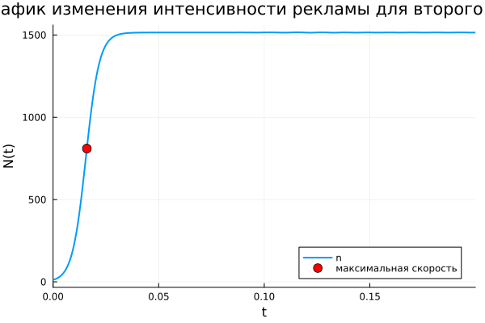{#fig-001 width=70%}

## Реализация в Julia

Найдем решение для третьего случая и построим его. Также найдем время, когда производная принимает максимальное значение(рис.6)

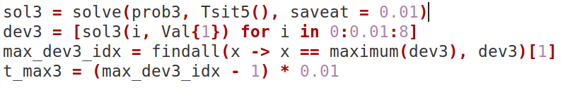{#fig-001 width=70%}

## Реализация в Julia

Из графика случая 3 видно, что максимальная скорость достигается уже при t ≈ 0.02, что значительно быстрее, чем в случае 1 и 2, но медленнее, чем в случае 2 (где t_max ≈ 0.016)(рис 7 и 8)

{#fig-001 width=70%}

## Реализация в Julia

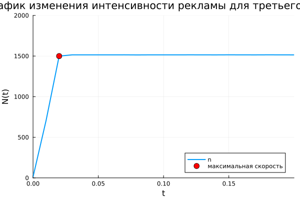{#fig-001 width=70%}

## Реализация в Julia

Мы сравним коэффициенты модели, используя график их изменения во времени(рис.9)

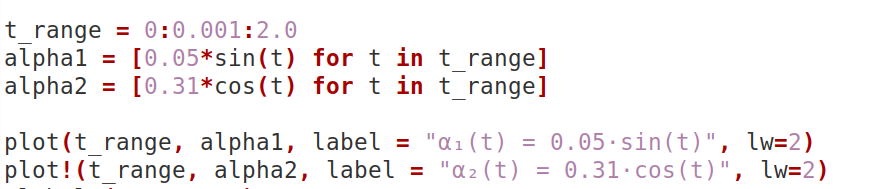{#fig-001 width=70%}

## Реализация в Julia

Мы видим, что поначалу сарафанное радио более эффективно, чем платная реклама, но со временем эффективность сарафанного радио снижается, и платная реклама начинает доминировать(рис.10)

## Реализация в Julia

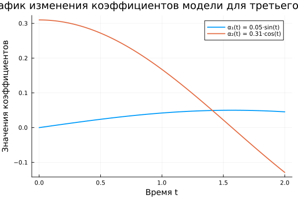{#fig-001 width=70%}

## Реализация в Scilab

Я создала такую же модель с помощью scilab. Для первого случая(рис.11)

## Реализация в Scilab

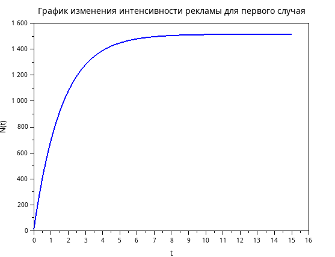{#fig-001 width=70%}

## Реализация в Scilab

Для второго случая получим график изменения интенсивности рекламы, также, выбрав в качестве отображаемой функции производную, получим график, на котором видна максимальная скорость изменения интенсивности рекламы(рис 12 и 13)

## Реализация в Scilab

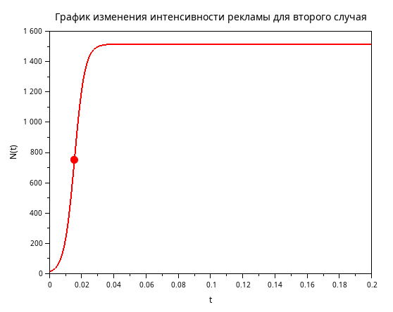{#fig-001 width=70%}

## Реализация в Scilab

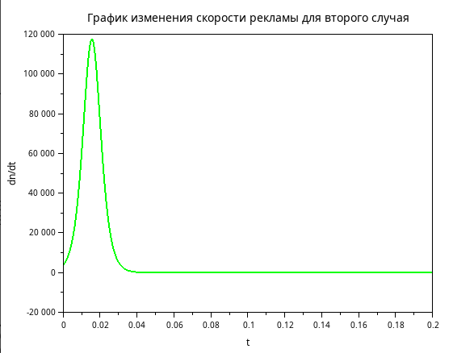{#fig-001 width=70%}

## Реализация в Scilab

Для третьего случая получим график изменения интенсивности рекламы, также, выбрав в качестве отображаемой функции производную, получим график, на котором видна максимальная скорость изменения интенсивности рекламы(рис 14 и 15)

## Реализация в Scilab

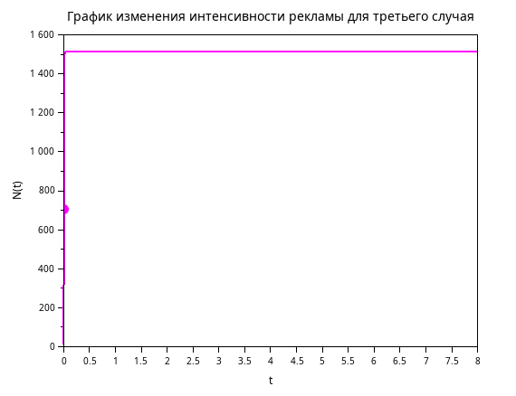{#fig-001 width=70%}

## Реализация в Scilab

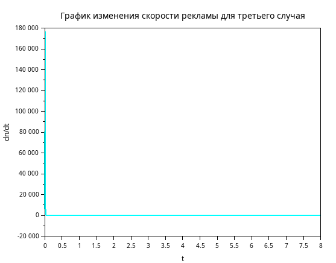{#fig-001 width=70%}

## Выводы

Выполнив эту лабораторную работу, построили математической модели Эффективность рекламы.
