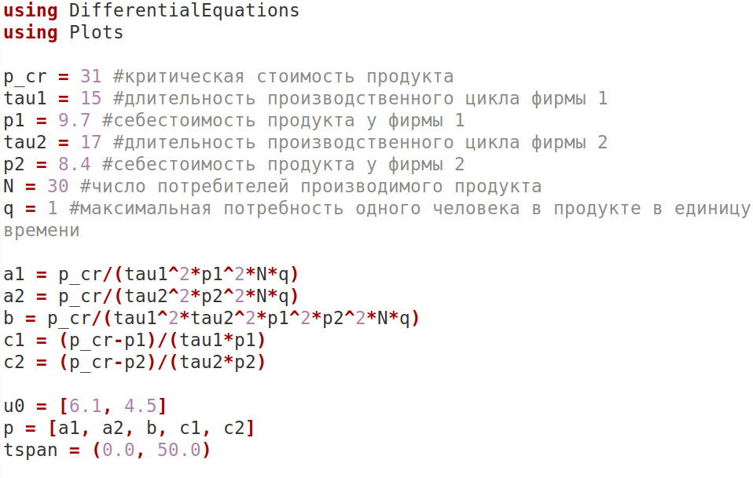
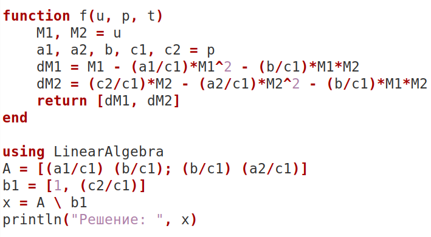
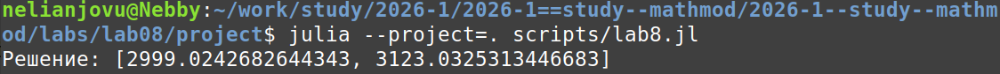
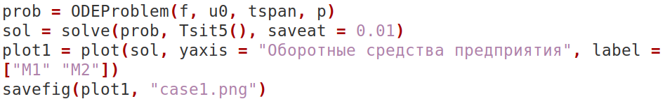
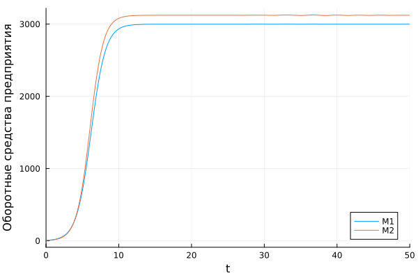
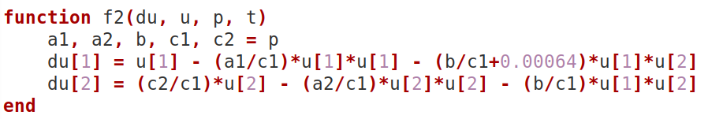
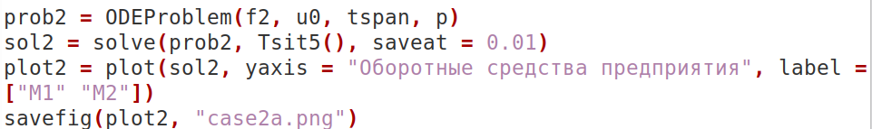
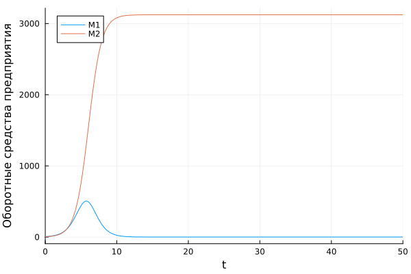
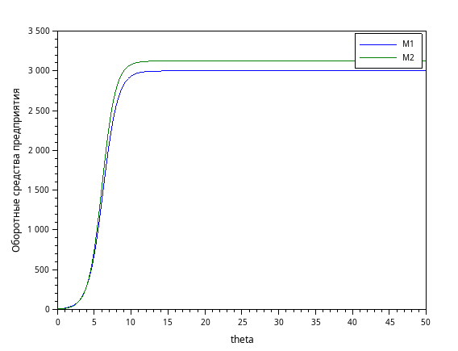
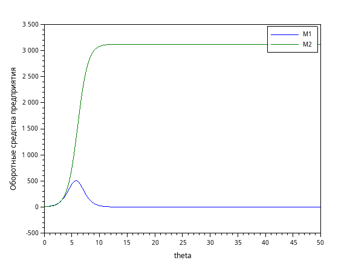

---
## Author
author:
  name: Нджову Нелиа
  degrees: DSc
  orcid: 0000-0002-0877-7063
  email: 1032239033@rudn.ru
  affiliation:
    - name: Российский университет дружбы народов
      country: Российская Федерация
      postal-code: 117198
      city: Москва
      address: ул. Миклухо-Маклая, д. 15

## Title
title: "Отчёта по лабораторной работе 8"
subtitle: "Математическое моделирование"
license: "CC BY"
---

```{julia}
#| echo: false
#| include: false
using Pkg
Pkg.activate("/home/nelianjovu/work/study/2026-1/2026-1==study--mathmod/2026-1--study--mathmod/labs/lab04/project")
```

# Цель работы

Целью данной лабораторной работы является построение математической модели конкуренции двух фирм.

# Задание

**Вариант 64**

**Случай 1.** Рассмотрим две фирмы, производящие взаимозаменяемые товары одинакового качества и находящиеся в одной рыночной нише. Считаем, что в рамках нашей модели конкурентная борьба ведётся только рыночными методами. То есть, конкуренты могут влиять на противника путем изменения параметров своего производства: себестоимость, время цикла, но не могут прямо вмешиваться в ситуацию на рынке («назначать» цену или влиять на потребителей каким-либо иным способом.) Будем считать, что постоянные издержки пренебрежимо малы, и в модели учитывать не будем. В этом случае динамика изменения объемов продаж фирмы 1 и фирмы 2 описывается следующей системой уравнений:

$$
\frac{dM_1}{d\theta} = M_1 - \frac{b}{c_1}M_1M_2 - \frac{a_1}{c_1}M1^2
$$
$$
\frac{dM_2}{d\theta} = \frac{c_2}{c_1}M_2 - \frac{b}{c_1}M_1M_2 - \frac{a_2}{c_1}M_2^2
$$

где: $a_1 = \frac{p_{cr}}{\tau_1^2p̃_1^2Nq}$, $a_2 = \frac{p_{cr}}{\tau_2^2p̃_2^2Nq}$, $b = \frac{p_{cr}}{\tau_1^2p̃_1^2\tau_2^2p̃_2^2Nq}$, $c_1 = \frac{p_{cr} - p̃_1}{\tau_1p̃_1}$, $c_2 = \frac{p_{cr} - p̃_2}{\tau_2p̃_2}$

Также введена нормировка t = c1$\theta$

**Случай 2**. Рассмотрим модель, когда, помимо экономического фактора влияния (изменение себестоимости, производственного цикла, использование кредита и т.п.), используются еще и социально-психологические факторы – формирование общественного предпочтения одного товара другому, не зависимо от их качества и цены. В этом случае взаимодействие двух фирм будет зависеть друг от друга, соответственно коэффициент перед $M_1*M_2$ будет отличаться. Пусть в рамках рассматриваемой модели динамика изменения объемов продаж фирмы 1 и фирмы 2 описывается следующей системой уравнений:

$$
\frac{dM_1}{d\theta} = M_1 - \left(\frac{b}{c_1} + 0.00064\right)M_1M_2 - \frac{a_1}{c_1}M1^2
$$
$$
\frac{dM_2}{d\theta} = \frac{c_2}{c_1}M_2 - \frac{b}{c_1}M_1M_2 - \frac{a_2}{c_1}M_2^2
$$

Для обоих случаев рассмотрим задачу со следующими начальными условиями и параметрами:

$M_0^1 = 6.1$, $M_0^2 = 4.5$, $p_{cr} = 31$, $N = 30$, $q = 1$, $\tau_1 = 15$, $\tau_2 = 17$, $p̃_1 = 9.7$, $p̃_2 = 8.4$

***Замечание:*** Значения $p_{cr}, p_{1,2}, N$ указаны в тысячах единиц, а значения $M_{1,2}$ указаны в млн. единиц.

***Обозначения:***

N – число потребителей производимого продукта.

$\tau$ – длительность производственного цикла

p – рыночная цена товара

p̃ – себестоимость продукта, то есть переменные издержки на производство единицы продукции.

q – максимальная потребность одного человека в продукте в единицу времени1

$\theta = \frac{t}{c_1}$ - безразмерное время

1. Постройте графики изменения оборотных средств фирмы 1 и фирмы 2 без учета постоянных издержек и с веденной нормировкой для случая 1.

2. Постройте графики изменения оборотных средств фирмы 1 и фирмы 2 без учета постоянных издержек и с веденной нормировкой для случая 2.

# Теоретическое введение

Математическому моделированию процессов конкуренции и сотрудничества двух фирм на различных рынках посвящено довольно много научных работ, в основном использующих аппарат теории игр и статистических решений. В качестве примера можно привести работы таких исследователей, как Курно, Стакельберг, Бертран, Нэш, Парето [1].

Следует отметить, что динамические дифференциальные модели уже давно и успешно используются для математического моделирования самых разнообразных по своей природе процессов. Достаточно упомянуть широко использующуюся в экологии модель «хищник-жертва» Вольтерра, математическую теорию развития эпидемий, модели боевых действий Задача решалась в следующей постановке [2].

На рынке однородного товара присутствуют две основные фирмы, разделяющие его между собой, т.е. имеет место классическая дуополия. Безусловно, это является весьма сильным предположением, однако оно вполне оправдано в тех случаях, когда доля продаж остальных конкурентов на рассматриваемом сегменте рынке пренебрежимо мала. Хорошим примером может служить отечественный рынок микропроцессоров, который по существу разделили между собой две фирмы: Intel и AMD.

Изменение объемов продаж конкурирующих фирм с течением времени описывается системой дифференциальных уравнений 

$$
\frac{dM_1}{d\theta} = M_1 - \frac{b}{c_1}M_1M_2 - \frac{a_1}{c_1}M1^2
$$
$$
\frac{dM_2}{d\theta} = \frac{c_2}{c_1}M_2 - \frac{b}{c_1}M_1M_2 - \frac{a_2}{c_1}M_2^2
$$

где: $a_1 = \frac{p_{cr}}{\tau_1^2p̃_1^2Nq}$, $a_2 = \frac{p_{cr}}{\tau_2^2p̃_2^2Nq}$, $b = \frac{p_{cr}}{\tau_1^2p̃_1^2\tau_2^2p̃_2^2Nq}$, $c_1 = \frac{p_{cr} - p̃_1}{\tau_1p̃_1}$, $c_2 = \frac{p_{cr} - p̃_2}{\tau_2p̃_2}$

***Обозначения:***

N – число потребителей производимого продукта.

$\tau$ – длительность производственного цикла

p – рыночная цена товара

p̃ – себестоимость продукта, то есть переменные издержки на производство единицы продукции.

q – максимальная потребность одного человека в продукте в единицу времени1

$\theta = \frac{t}{c_1}$ - безразмерное время

# Выполнение лабораторной работы

## Реализация в Julia

Зададим функцию для решения модели конкуренции двух фирм. Возьмем
интервал t ∈ [0; 50]. Рассмотрим сначала реализацию в Julia. Зададим значения параметров(рис.1)

{#fig-001 width=70%}

Зададим функцию для первого случая. Найдем стационарное состояние системы, для этого воспользуемся библиотекой LinearAlgebra, зададим матрицу коэффициент системы линейных уравнений и вектор решений b1(рис.2)

{#fig-002 width=70%}

Получим значение: $M_1c$ = 2999.0242682644343, $M_2c = $3123.0325313446683. Эти значения соответствуют максимальным значениям полученного решения модели(рис.3)

{#fig-003 width=70%}

Для задания проблемы используется функция ODEProblem, а для решения численный метод Tsit5(), с помощью plot построим график решения для первого случая(рис.4)

{#fig-002 width=70%}

Из графика для случая 1 мы видим, что обе фирмы завоевывают свою долю рынка и стабилизируются. Однако фирма 2 доминирует на рынке, располагая значительно большим оборотным капиталом(рис.5)

{#fig-002 width=70%}

Зададим функцию для второго случая(рис.6)

{#fig-006 width=70%}

Для задания проблемы используется функция ODEProblem, а для решения численный метод Tsit5(), с помощью plot построим график решения для второго случая(рис.7)

{#fig-007 width=70%}

Из графика случая 2 мы видим, что во втором случае фирма 1 не выдерживает конкуренции. Оборотный капитал фирмы 1 падает до нуля, что приводит к ее банкротству. Фирма 2 захватывает весь рынок(рис.8)

{#fig-008 width=70%}

## Реализация в Scilab

Я создала такую же модель с помощью scilab

'''
p_cr = 31; //критическая стоимость продукта
tau1 = 15; //длительность производственного цикла фирмы 1
p1 = 9.7; //себестоимость продукта у фирмы 1
tau2 = 17; //длительность производственного цикла фирмы 2
p2 = 8.4; //себестоимость продукта у фирмы 2
N = 30; //число потребителей производимого продукта
q = 1; //максимальная потребность одного человека в продукте в единицу времени

a1 = p_cr/(tau1*tau1*p1*p1*N*q);
a2 = p_cr/(tau2*tau2*p2*p2*N*q);
b = p_cr/(tau1*tau1*tau2*tau2*p1*p1*p2*p2*N*q);
c1 = (p_cr-p1)/(tau1*p1);
c2 = (p_cr-p2)/(tau2*p2);

// Случай 1
function dx=sysf(t, x)
    dx(1) = (c1/c1)*x(1) - (a1/c1)*x(1)*x(1) - (b/c1)*x(1)*x(2);
    dx(2) = (c2/c1)*x(2) - (a2/c1)*x(2)*x(2) - (b/c1)*x(1)*x(2);
endfunction

t0 = 0;
x0 = [6.1; 4.5];
t = [0:0.01:50];
y = ode(x0, t0, t, sysf);
scf(1);
plot(t, y);
xlabel("theta");
ylabel("Оборотные средства предприятия");
legend(["M1" "M2"]);
xs2png(1, "case1.png");

// Случай 2
function dx=sysf2(t, x)
    dx(1) = (c1/c1)*x(1) - (a1/c1)*x(1)*x(1) - (b/c1+0.00064)*x(1)*x(2);
    dx(2) = (c2/c1)*x(2) - (a2/c1)*x(2)*x(2) - (b/c1)*x(1)*x(2);
endfunction

y2 = ode(x0, t0, t, sysf2);
scf(2);
plot(t, y2);
xlabel("theta");
ylabel("Оборотные средства предприятия");
legend(["M1" "M2"]);
xs2png(2, "case2a.png");

// Приближенный график для второго случая
scf(3);
plot(t, y2);
xlabel("theta");
ylabel("Оборотные средства предприятия");
legend(["M1" "M2"]);
zoom_rect([0,0,50,2]);
xs2png(3, "case2b.png");
'''
Я получила те же графики, что и при использовании Julia(рис.9 и 10)

{#fig-009 width=70%}

{#fig-010 width=70%}

# Выводы

Делая эту лабораторную работу, я построила математическую модель конкуренции двух фирм.

# Список литературы

1. Малыхин В.И. Математическое моделирование экономики. М., УРАО, 1998.160 с.

2. Кулябов Д.С. Лабораторная работа 8. Модель конкуренции двух фирм [Электронный ресурс]

