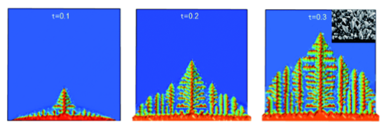

---
## Author
author:
  name: Вакутайпа Милдред, Разанацуа Сара Естэлл, Нджову Нелиа
  degrees: BSc
  orcid: 0009-0001-3145-3518
  email: 1032239009@rudn.ru
  affiliation:
    - name: Российский университет дружбы народов
      country: Российская Федерация
      postal-code: 117198
      city: Москва
      address: ул. Миклухо-Маклая, д. 6

## Title
title: "Групповой проект. Этап 2"
subtitle: "Алгоритм решения задачи Рост дендритов"
license: "CC BY"
---

# Введение

## Актуальность

Дендрит - это характерная древовидная структура кристаллов, растущих по мере затвердевания расплавленного металла, форма, получаемая в результате более быстрого роста в энергетически выгодных кристаллографических направлениях.

Процессы кристаллизации и роста дендритов играют ключевую роль в различных областях науки и техники. В металлургии и материаловедении структура затвердевших металлов и сплавов, образующаяся в процессе литья, сварки и аддитивного производства, определяет их механические свойства — прочность, пластичность и усталостную долговечность. Дендритная микроструктура, возникающая при неравновесном затвердевании, непосредственно влияет на распределение примесей, образование пор и трещин, а также на последующую термообработку материала.

В природе дендритные структуры также широко распространены: от снежинок и морозных узоров на стекле до минеральных образований в геологических процессах. Понимание механизмов роста дендритов важно не только для технологических применений, но и для фундаментальной физики неравновесных процессов структурообразования. Несмотря на многолетние исследования, проблема управляемого управления дендритной микроструктурой остается актуальной.

## Цель

Целью данной работы является написание алгоритма реализации модели роста дендритов.

## Задачи

Изучите алгоритм модели роста дендритов и опишите основные этапы работы алгоритма

# Алгоритм

## Шаг 1: Настройка параметров модели

Первый этап включает в себя определение физических свойств материала и вычислительных параметров для моделирования. Корректность входных данных определяет надежность всего процесса моделирования.

### Физические свойства материала:

- Плотность $\rho$: определяет массу на единицу объема материала.
- Удельная теплоемкость $c_p$: количество энергии, необходимо для нагрева единицы массы на один градус.
- Скрытая теплота плавления $L$: энергия фазавого перехода
- Теплопроводность $\kappa$: способность материала передавать тепловую энергию
- Коэффициент температуропроводности $\chi = \kappa/(\rho c_p)$: скорость выравнивания температурного градиента
- Температура плавления $T_m$: критическая точка фазового перехода
- Коэффициент поверхностного натяжения $\gamma$: влияет на стабильность границы раздела фаз
- Кинетический коэффициент $\beta$: характеризует скорость прикрепления атомов к поверхности кристалла[1,2]

### Вычислительные параметры

- Размер сетки $N \times N$: Количество узлов по каждому измерению
- Пространственный шаг $h$: Расстояние между соседними узлами
- Временной шаг роста $\Delta$: Интервал одного шага роста
- Число подшагов $m$: Количество подшагов тепловой диффузии
- Капиллярный параметр $\lambda$: Интенсивность стабилизации границы
- Амплитуда шума $\delta$: Уровень тепловых флуктуаций[3]

### Начальные и граничные условия:

- Начальная температура расплава $T_\infty$: определяет степень переохлаждения системы
- Безразмерное переохлаждение $S = c_p (T_m - T_\infty)/L$: ключевой параметр термодинамической готовности системы
- Граничные условия: постоянная температура на всех границах расчетной области, равная начальной температуре расплава $T_\infty$[4] 

## Шаг 2: Инициализация структур данных

На втором этапе создаются структуры данных для хранения состояния системы и задается начальная конфигурация.

### Структуры данных:

Создаются два двумерных массива размером $N \times N$:

1. Массив фазового состояния $phase[i][j]$:

- $phase[i][j] = 1$ — твердая фаза
- $phase[i][j] = 0$ — жидкая фаза

2. Массив безразмерной температуры $T[i][j]$:

- Хранит текущее значение безразмерной температуры в каждом узле

### Инициализация:

1. Заполнение массивов начальными значениями:

- Все узлы: $phase[i][j] = 0$ (жидкое состояние)
- Все узлы: $T[i][j] = 0$ (безразмерная температура расплава)

2. Создание затравки кристаллизации:

- В центральной области сетки задается твердая затравка (например, квадрат $5 \times 5$ узлов)
- Для узлов затравки: $phase[i][j] = 1$ (твердое состояние)
- Для узлов затравки: $T[i][j] = \tilde{T}_m$ (безразмерная температура плавления)

## Шаг 3: Расчет температурного поля

Третий шаг реализует численное решение уравнения теплопроводности для расчета эволюции температурного поля.[3]

### Дискретизация уравнения теплопроводности:

Используется явная конечно-разностная схема. Лапласиан в узле $(i,j)$ аппроксимируется с учетом ближайших и диагональных соседей:

$$
\nabla^2 T \approx \frac{\langle T_{(i,j)} \rangle - T_{i,j}}{(4 + 4w)(1 + 2w)h^2}
$$

где среднее значение температуры соседей:

$$
\langle T_{(i,j)} \rangle = \frac{ (T_{i+1,j} + T_{i-1,j} + T_{i,j+1} + T_{i,j-1}) + w (T_{i+1,j+1} + T_{i+1,j-1} + T_{i-1,j+1} + T_{i-1,j-1}) }{4 + 4w}
$$

Коэффициент $w = 1/2$ определяет вклад диагональных соседей.[4]

### Алгоритм расчета тепловой диффузии:

Для каждого шага роста $\Delta t$ выполняется $m$ подшагов тепловой диффузии:

1. Для каждого узла сетки $(i, j)$ вычислить лапласиан $\nabla^2 T_{i,j}$ по приведенной формуле

2. Обновить температуру: $T_{i,j}^{new} = T_{i,j} + \chi \frac{\Delta t}{m} \nabla^2 T_{i,j}$

3. Применить граничные условия постоянной температуры: $T_{граница} = 0$

### Условие устойчивости:

$$
\frac{\chi \Delta t}{m h^2} < \frac{1}{4}
$$

## Шаг 4: Моделирование роста дендритов

На четвертом этапе после завершения всех подшагов тепловой диффузии выполняется проверка условий затвердевания и обновление фазового состояния.

### Порядок обновления:

Важной особенностью алгоритма является последовательное обновление:

1. Сначала полностью рассчитывается температурное поле на текущем шаге (все $m$ подшагов)

2. Затем, на основе полученного температурного поля, проверяются условия затвердевания

### Вычисление кривизны границы:

Для жидкого узла, имеющего хотя бы один твердый сосед, вычисляется дискретизированная кривизна:[3]

$$
s_{i,j} = \sum_{\text{nearest}} n_{i,j} + w_n \sum_{\text{diagonal}} n_{i,j} - \left( \frac{5}{2} + \frac{5}{2} w_n \right)
$$

где:

- $n_{i,j} = 1$ если соседний узел твердый, и $0$ в противном случае
- $w_n = 1/2$ — весовой коэффициент для диагональных соседей
- $s_{i,j} < 0$ для выпуклых участков (вершин), $s_{i,j} > 0$ для вогнутых

### Критерий затвердевания:

Жидкий узел переходит в твердое состояние, если выполняется условие:

$$
T_{i,j} \le \tilde{T}_m + \lambda s_{i,j} + \eta_{i,j} \delta
$$

где:

- $\tilde{T}_m$ — безразмерная температура плавления
- $\lambda$ — капиллярный параметр, объединяющий эффекты Гиббса–Томсона и кинетического переохлаждения[2]
- $s_{i,j}$ — дискретизированная кривизна

- $\eta_{i,j}$ — случайное число из равномерного распределения $[-1, 1]$
- $\delta$ — амплитуда теплового шума[3]

### Алгоритм проверки затвердевания:

1. Полный обход всех узлов сетки $(i, j)$

2. Для каждого узла:

- Если $phase[i][j] = 1$ (твердый), пропустить
- Если $phase[i][j] = 0$ (жидкий), проверить наличие твердых соседей
- Если твердые соседи отсутствуют, пропустить
- Если твердые соседи есть:
  - Вычислить $s_{i,j}$ на основе соседних узлов
  - Сгенерировать случайное число $\eta_{i,j}$
  - Проверить критерий затвердевания
  - Если условие выполнено:
    - $phase[i][j] = 1$ (переход в твердое состояние)
    - $T[i][j] = T[i][j] + 1$ (выделение скрытой теплоты)[3]

## Шаг 5: Организация основного цикла вычислений

Пятый этап описывает структуру основного вычислительного цикла.

### Блок-схема алгоритма:

Алгоритм моделирования роста дендритов состоит из следующих основных этапов:

1. Начало: Запуск программы

2. Шаг 1: Настройка параметров модели

- Определение физических свойств материала (ρ, c_p, κ, L, T_m, γ, β)
- Определение вычислительных параметров (N, h, Δt, m, λ, δ)
- Определение начальных и граничных условий (T_∞, T_граница = T_∞)

3. Шаг 2: Инициализация массивов

- Создание массива фазового состояния phase[N][N] (все узлы = 0 — жидкие)
- Создание массива температуры T[N][N] (все узлы = 0)
- Создание твердой затравки в центре (phase = 1, T = T̃_m)

4. Проверка условия остановки

- Если дендрит достиг границы → переход к завершению
- Если не достиг → продолжение вычислений

5. Шаг 3: Расчет температурного поля

- Выполнение m подшагов тепловой диффузии:
  - Для каждого узла вычислить лапласиан ∇²T
  - Обновить температуру T_new = T + χ·(Δt/m)·∇²T
  - Применить граничные условия T_граница = 0

6. Шаг 4: Моделирование роста

- Обход всех узлов сетки:
  - Для каждого жидкого узла с твердыми соседями:
    - Вычислить кривизну s_ij
    - Сгенерировать случайный шум η_ij
    - Проверить критерий затвердевания: T ≤ T̃_m + λ·s_ij + η·δ
    - Если условие выполнено:
      - phase[i][j] = 1 (переход в твердое состояние)
      - T[i][j] = T[i][j] + 1 (выделение скрытой теплоты)

7. Сохранение результатов

- Запись фазового и температурного полей для визуализации

8. Возврат к проверке условия остановки (пункт 4)

9. Конец: Завершение моделирования

### Условие остановки:

Вычисления продолжаются до тех пор, пока дендрит не достигнет границы расчетной области. Условие проверяется после каждого шага роста: если любой твердый узел находится на границе сетки, моделирование завершается.

## Шаг 6: Исследование зависимости характеристик роста от параметров

На шестом этапе выполняются серии расчетов для анализа влияния ключевых параметров на морфологию дендритов.[1]

### Параметры для исследования:

| Параметр | Диапазон | Исследуемый эффект |
|----------|----------|-------------------|
| Переохлаждение $\tilde{T}_m$ | 0.1–0.9 | Скорость роста, плотность ветвления |
| Капиллярный параметр $\lambda$ | 0.01–0.5 | Стабилизация границы, радиус вершины |
| Амплитуда шума $\delta$ | 0–0.2 | Вторичное ветвление, симметрия |
| Температуропроводность $\chi$ | 0.1–0.5 | Скорость отвода тепла |

### Анализируемые характеристики:

1. Скорость роста вершины: измеряется как смещение фронта во времени

2. Радиус кривизны вершины: определяется по конфигурации твердой фазы

3. Плотность вторичных ветвей: количество ответвлений на единицу длины

4. Время достижения границы: полное время моделирования до остановки

### Методика проведения исследований:

1. Зафиксировать все параметры, кроме исследуемого

2. Выполнить серию расчетов с различными значениями исследуемого параметра

3. Для каждого расчета сохранить:

- Финальную морфологию дендрита
- Зависимость скорости роста от времени
- Время достижения границы

4. Построить графики зависимостей характеристик от параметров

## Шаг 7: Визуализация результатов

Седьмой этап обеспечивает графическое представление процесса роста и финальных результатов(рис. 1)

{#fig-048 width=70%}

### Визуализация в процессе моделирования:

На каждом шаге роста (или с заданной периодичностью) сохраняются:

1. Фазовое поле: отображение твердой (например, черный) и жидкой (белый) фаз

2. Температурное поле: цветовая карта распределения безразмерной температуры

### Финальная визуализация:

По завершении моделирования:

- Построение финальной морфологии дендрита
- Создание анимации процесса роста на основе сохраненных кадров
- Построение графиков зависимостей (скорость роста от времени, влияние параметров)

# Вывод

На втором этапе группового проекта описан алгоритм из 7 шагов для моделирования роста дендритов в переохлажденном расплаве. Граничные условия задаются постоянной температурой, равной начальной температуре расплава.

# Список литературы{.unnumbered}

1. W. W. Mullins and R. F. Sekerka, "Stability of a planar interface during solidification of a dilute binary alloy," Journal of Applied Physics, vol. 35, no. 2, pp. 444–451, 1964.

2. J. W. Gibbs, "On the Equilibrium of Heterogeneous Substances," Transactions of the Connecticut Academy of Arts and Sciences, vol. 3, pp. 108–248, 1875–1878.

3. Y. Saito, G. Goldbeck-Wood, and H. Müller-Krumbhaar, "Numerical simulation of dendritic growth," Physical Review A, vol. 38, no. 4, pp. 2148–2157, 1988.

4. Д. А. Медведев, "Моделирование физических процессов и явлений на ПК," учебное пособие

5. Wang K. и др. Dendrite growth in the recharging process of zinc–air batteries [Электронный ресурс]. Journal of Materials Chemistry A, 2025. URL: https://pubs.rsc.org/en/
content/articlelanding/2015/ta/c5ta06366c/unauth.

